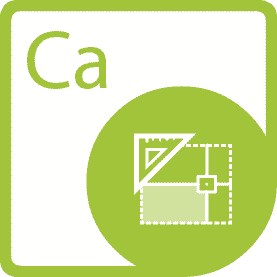

{} 

**Willkommen bei Aspose.Words für .NET**

Aspose.Words für .NET ist eine Klassenbibliothek, die es Ihren Anwendungen ermöglicht, eine Vielzahl von Dokumentenverarbeitungsaufgaben auszuführen. Aspose.Words unterstützt DOC, DOCX, RTF, HTML, OpenDocument, PDF, XPS, EPUB und andere Formate. Mit Aspose.Words können Sie Dokumente generieren, ändern, konvertieren, rendern und drucken, ohne Microsoft Word® zu verwenden.

{} 

## **Aspose.Words für .NET-Ressourcen**

Im Folgenden finden Sie Links zu einigen nützlichen Ressourcen, die Sie möglicherweise zur Erfüllung Ihrer Aufgaben benötigen.

- [Aspose.Words for .NET Online-Dokumentation](https://docs.aspose.com/words/net/)
- [Aspose.Words für .NET-Funktionen](https://docs.aspose.com/words/net/feature-overview)
- [Aspose.Words für .NET-Beschränkungen](https://docs.aspose.com/words/net/what-document-features-are-supported)
- [Aspose.Words für .NET-Versionshinweise](https://docs.aspose.com/words/net/release-notes/)
- [Aspose.Words für .NET-Produktseite](https://products.aspose.com/words/net)
- [Aspose.Words für .NET herunterladen](https://downloads.aspose.com/words/net)
- [Aspose.Words für .NET NuGet-Paket installieren](https://www.nuget.org/packages/Aspose.Words/)
- [Aspose.Words für .NET-API-Referenzhandbuch](https://apireference.aspose.com/net/words)
- [Beispiele im GitHub-Repository herunterladen] (https://github.com/aspose-words/Aspose.Words-for-.NET)
- [Aspose.Words for .NET Free Support Forum](https://forum.aspose.com/c/words)
- [Aspose.Words für den kostenpflichtigen .NET-Support-Helpdesk](https://helpdesk.aspose.com/)

{} 

**Willkommen bei Aspose.PDF für .NET**

Aspose.PDF ist eine .NET-Komponente, die entwickelt wurde, um es Entwicklern zu ermöglichen, einfache oder komplexe PDF-Dokumente im Handumdrehen programmgesteuert zu erstellen. Aspose.PDF für .NET ermöglicht Entwicklern das Einfügen von Tabellen, Grafiken, Bildern, Hyperlinks, benutzerdefinierten Schriftarten – und mehr – in PDF-Dokumente. Darüber hinaus ist es auch möglich, PDF-Dokumente zu komprimieren. Aspose.PDF für .NET bietet hervorragende Sicherheitsfunktionen zur Entwicklung sicherer PDF-Dokumente. Und das hervorstechendste Merkmal von Aspose.PDF für .NET ist, dass es die Erstellung von PDF-Dokumenten sowohl über eine API als auch aus XML-Vorlagen unterstützt.

{} 

## **Aspose.PDF für .NET-Ressourcen**

Im Folgenden finden Sie Links zu einigen nützlichen Ressourcen, die Sie möglicherweise zur Erfüllung Ihrer Aufgaben benötigen.

- [Aspose.PDF für .NET Online-Dokumentation](https://docs.aspose.com/pdf/net/)
- [Aspose.PDF für .NET-Funktionen](https://docs.aspose.com/pdf/net/feature-list)
- [Aspose.PDF für .NET Versionshinweise](https://docs.aspose.com/pdf/net/release-notes/)
- [Aspose.PDF für .NET-Produktseite](https://products.aspose.com/pdf/net)
- [Aspose.PDF für .NET NuGet-Paket installieren](https://www.nuget.org/packages/Aspose.PDF/)
- [Aspose.PDF für .NET-API-Referenzhandbuch] (https://apireference.aspose.com/net/pdf)
- [Aspose.PDF für .NET Free Support Forum](https://forum.aspose.com/c/pdf)
- [Aspose.PDF für .NET Paid Support Helpdesk](https://helpdesk.aspose.com/)

{} 

**Willkommen bei Aspose.Cells für .NET**

Aspose.Cells für .NET ist eine Programmierbibliothek für Tabellenkalkulationen, mit der Softwareentwickler Tabellenkalkulationsdateien aus ihren eigenen Anwendungen heraus manipulieren und konvertieren können. Als Kombination aus APIs und GUI-Steuerelementen beschleunigt Aspose.Cells für .NET die Microsoft Excel®-Programmierung und -Konvertierung. Aspose.Cells für .NET unterstützt die gängigen Dateiformate für Tabellenkalkulationen (XLS, XLSX, XLSM, XLSB, XLTX, XLTM, CSV, SpreadsheetML, ODS), die Ihr Unternehmen täglich verwendet. Es ermöglicht auch den Export von Excel-Dateien in PDF, XPS, HTML, MHTML, Nur-Text und gängige Bildformate wie TIFF, JPG, PNG, BMP und SVG.

{} 

## **Aspose.Cells für .NET-Ressourcen**

Im Folgenden finden Sie Links zu einigen nützlichen Ressourcen, die Sie möglicherweise zur Erfüllung Ihrer Aufgaben benötigen.

- [Aspose.Cells for .NET Online-Dokumentation](https://docs.aspose.com/cells/net/)
- [Aspose.Cells für .NET-Funktionen](https://docs.aspose.com/cells/net/feature-overview/)
- [Aspose.Cells für .NET-Einschränkungen](https://docs.aspose.com/cells/net/what-document-features-are-supported/)
- [Aspose.Cells für .NET Versionshinweise](https://docs.aspose.com/cells/net/release-notes/)
- [Aspose.Cells für .NET-Produktseite](https://products.aspose.com/cells/net)
- [Aspose.Cells für .NET NuGet-Paket installieren](https://www.nuget.org/packages/Aspose.Cells/)
- [Aspose.Cells für .NET-API-Referenzhandbuch] (https://apireference.aspose.com/cells/net)
- [Aspose.Cells for .NET Free Support Forum](https://forum.aspose.com/c/cells)
- [Aspose.Cells for .NET Kostenpflichtiger Support-Helpdesk](https://helpdesk.aspose.com/)

{} 

**Willkommen bei Aspose.Email für .NET**

Aspose.Email für .NET ist eine Suite flexibler und einfach zu verwendender .NET-Klassenbibliotheken, die zusammengeführt wurden, um eine einzigartige und leistungsstarke E-Mail-Programmierkomponente zu erstellen. Aspose.Email spart Ihnen Zeit und Mühe, indem es Ihnen ermöglicht, die Handhabung komplexer Nachrichtendateien schnell und einfach in Ihre Anwendungen zu codieren.

Aspose.Email implementiert eine Reihe von Netzwerkprotokollen, zum Beispiel SMTP, MIME, POP3, IMAP; Nachrichtendateiformate, zum Beispiel EML, MSG, MHT; E-Mail-Speicherformate wie PST und MBOX; und Exchange Server, damit Entwickler eine Vielzahl von E-Mail-Verarbeitungsanwendungen erstellen können. Aspose.Email hilft Entwicklern beim Programmieren, ohne sich in der Komplexität von Nachrichtenformatdetails zu verlieren.

{} 

## **Aspose.Email für .NET-Ressourcen**

Im Folgenden finden Sie Links zu einigen nützlichen Ressourcen, die Sie möglicherweise zur Erfüllung Ihrer Aufgaben benötigen.

- [Aspose.Email für .NET Online-Dokumentation](https://docs.aspose.com/email/net/)
- [Aspose.Email für .NET-Funktionen](https://docs.aspose.com/email/net/features-overview)
- [Aspose.Email für .NET Versionshinweise](https://docs.aspose.com/email/net/release-notes/)
- [Aspose.Email für .NET-Produktseite](https://products.aspose.com/email/net)
- [Aspose.Email für .NET NuGet-Paket installieren](https://www.nuget.org/packages/Aspose.Email/)
- [Aspose.Email für .NET-API-Referenzhandbuch] (https://apireference.aspose.com/net/email)
- [Aspose.Email for .NET Free Support Forum](https://forum.aspose.com/c/email)
- [Aspose.Email for .NET Paid Support Helpdesk](https://helpdesk.aspose.com/)

{} 

**Willkommen bei Aspose.Slides für .NET**

Aspose.Slides for .NET ist eine Microsoft PowerPoint®-Verwaltungs-API, mit der .NET-Anwendungen PowerPoint®-Dokumente lesen und schreiben können, ohne Microsoft PowerPoint® zu verwenden. Aspose.Slides for .NET ist die erste und einzige Komponente, die die Funktionalität zur Verwaltung von PowerPoint®-Dokumenten bereitstellt. Aspose.Slides für .NET bietet viele Schlüsselfunktionen wie das Verwalten von Text, Formen, Tabellen und Animationen, das Hinzufügen von Audio und Video zu Folien, die Vorschau von Folien, den Export von Folien in das SVG-, PDF-Format und mehr.

{} 

## **Aspose.Slides für .NET-Ressourcen**

Im Folgenden finden Sie Links zu einigen nützlichen Ressourcen, die Sie möglicherweise zur Erfüllung Ihrer Aufgaben benötigen.

- [Aspose.Slides for .NET Online-Dokumentation](https://docs.aspose.com/slides/net/)
- [Aspose.Slides für .NET-Funktionen](https://docs.aspose.com/slides/net/features-overview)
- [Aspose.Slides für .NET-Einschränkungen](https://docs.aspose.com/slides/net/known-issues)
- [Aspose.Slides für .NET Versionshinweise](https://docs.aspose.com/slides/net/release-notes/)
- [Aspose.Slides für .NET-Produktseite](https://products.aspose.com/slides/net)
- [Aspose.Slides für .NET NuGet-Paket installieren](https://www.nuget.org/packages/Aspose.Slides.NET/)
- [Aspose.Slides für .NET-API-Referenzhandbuch] (https://apireference.aspose.com/net/slides)
- [Beispiele im GitHub-Repository herunterladen] (https://github.com/aspose-slides/Aspose.Slides-for-.NET)
- [Aspose.Slides for .NET Free Support Forum](https://forum.aspose.com/c/slides)
- [Aspose.Slides for .NET Paid Support Helpdesk](https://helpdesk.aspose.com/)

{} 

**Willkommen bei Aspose.Imaging für .NET**

Aspose.Imaging für .NET bietet eine Reihe flexibler Routinen zum Erstellen und Bearbeiten von Bildern in .NET-Anwendungen. Es funktioniert unabhängig von anderen Grafikanwendungen und erfordert nicht, dass ein Bildbearbeitungsprogramm auf dem Computer installiert ist. Aspose.Imaging erweitert die native Unterstützung für Bildformate und Bildverarbeitungsfunktionen für .NET. Aspose.Imaging ermöglicht es Entwicklern, Bilder schnell und einfach in ihren eigenen Programmen zu manipulieren.

Die Komponente unterstützt die gängigsten Rasterdateiformate und bietet eine Vielzahl von Komprimierungsalgorithmen sowie zahlreiche Bildverarbeitungsoperationen. Bildexport und -konvertierung sind Kernfunktionen von Aspose.Imaging. Die Komponente ermöglicht es Entwicklern beispielsweise, Bilder in Thumbnails umzuwandeln oder einfach innerhalb einer Organisation zu teilen. Aspose.Imaging bietet Hochgeschwindigkeitsverarbeitung durch nativen Bytezugriff und eine Reihe effizienter Algorithmen. Die Komponente geht über Konvertierungen hinaus und ermöglicht es Entwicklern, Objekte mit Kernfunktionen sowie erweiterten Funktionen (basierend auf Grafikpfad) zu zeichnen. Aspose.Imaging verfügt über eine integrierte plattformübergreifende Portabilität. Im Moment unterstützen wir auch das Arbeiten in Mono.

{} 

## **Aspose.Imaging für .NET-Ressourcen**

Im Folgenden finden Sie Links zu einigen nützlichen Ressourcen, die Sie möglicherweise benötigen, um die Verwendung von Aspose.Imaging zu genießen.

- [Aspose.Imaging for .NET Online-Dokumentation](https://docs.aspose.com/imaging/net/)
- [Aspose.Imaging für .NET-Funktionen](https://docs.aspose.com/imaging/net/features/)
- [Aspose.Imaging für .NET-Einschränkungen](https://docs.aspose.com/imaging/net/known-issues)
- [Aspose.Imaging für .NET Versionshinweise](https://docs.aspose.com/imaging/net/release-notes/)
- [Aspose.Imaging für .NET-Produktseite](https://products.aspose.com/imaging/net)
- [Aspose.Imaging für .NET NuGet-Paket installieren](https://www.nuget.org/packages/Aspose.Imaging/)
- [Aspose.Imaging für .NET-API-Referenzhandbuch](https://apireference.aspose.com/net/imaging)
- [Beispiele im GitHub-Repository herunterladen] (https://github.com/aspose-imaging/Aspose.Imaging-for-.NET)
- [Aspose.Imaging for .NET Free Support Forum](https://forum.aspose.com/c/imaging)
- [Aspose.Imaging for .NET Kostenpflichtiger Support-Helpdesk](https://helpdesk.aspose.com/)

{} 

**Willkommen bei Aspose.BarCode für .NET**

Aspose.BarCode for .NET ist eine Reihe von Barcode-Generierungs- und -Erkennungskomponenten, die entwickelt wurden, um Entwicklern das Hinzufügen von Barcode-Funktionalität in ihre .NET-Anwendungen zu ermöglichen. Aspose.BarCode bietet GUI-basierte Steuerelemente zum Anzeigen von Barcodes in Windows Forms und stellt einen einfachen Satz von Klassen bereit, mit denen Entwickler Barcodes im Backend erstellen können. Aspose.BarCode entspricht den meisten heute verfügbaren Barcode-Standards und -Spezifikationen. Aspose.BarCode für .NET erstellt nicht nur Barcodes, sondern bietet ein komplettes Framework, um fast alles über sie zu steuern.

{} 

## **Aspose.BarCode für .NET-Ressourcen**

Im Folgenden finden Sie Links zu einigen nützlichen Ressourcen, die Sie möglicherweise zur Erfüllung Ihrer Aufgaben benötigen.

- [Aspose.BarCode für .NET Online-Dokumentation](https://docs.aspose.com/barcode/net/)
- [Aspose.BarCode für .NET-Funktionen](https://docs.aspose.com/barcode/net/product-overview/)
- [Aspose.BarCode für .NET Versionshinweise](https://docs.aspose.com/barcode/net/release-notes/)
- [Aspose.BarCode für .NET-Produktseite](https://products.aspose.com/barcode/net)
- [Aspose.BarCode für .NET NuGet-Paket installieren](https://www.nuget.org/packages/Aspose.Barcode/)
- [Aspose.BarCode für .NET-API-Referenzhandbuch](https://apireference.aspose.com/net/barcode)
- [Aspose.BarCode for .NET Free Support Forum](https://forum.aspose.com/c/barcode)
- [Aspose.BarCode für .NET Paid Support Helpdesk](https://helpdesk.aspose.com/)

{} 

**Willkommen bei Aspose.Diagram für .NET**

Aspose.Diagram ist eine reine .NET-API für die Arbeit mit dem Microsoft Visio-Objektmodell. Aspose.Diagram bietet eine bessere Leistung und ist einfacher zu verwenden, um Diagramme zu bearbeiten und Dateien zu konvertieren als Microsoft Office Automation.

Aspose.Diagram nutzt erweiterte Funktionen von Microsoft Office Visio, um Visio-Diagramme auf einem Server zu bearbeiten. Die Aspose.Diagram-API ist erweiterbar, einfach zu verwenden, kompakt und bietet die gängigsten Funktionen, sodass Entwickler weniger Code schreiben müssen.

{} 

## **Aspose.Diagram für .NET-Ressourcen**

Im Folgenden finden Sie Links zu einigen nützlichen Ressourcen, die Sie möglicherweise zur Erfüllung Ihrer Aufgaben benötigen.

- [Aspose.Diagram for .NET Online Documentation](https://docs.aspose.com/diagram/net/)
- [Aspose.Diagram für .NET-Funktionen](https://docs.aspose.com/diagram/net/feature-list/)
- [Aspose.Diagram for .NET Versionshinweise](https://docs.aspose.com/diagram/net/release-notes/)
- [Aspose.Diagram für .NET-Produktseite](https://products.aspose.com/diagram/net)
- [Installieren Sie Aspose.Diagram für das .NET NuGet-Paket](https://www.nuget.org/packages/Aspose.Diagram/)
- [Aspose.Diagram für .NET-API-Referenzhandbuch] (https://apireference.aspose.com/net/diagram)
- [Aspose.Diagram for .NET Free Support Forum](https://forum.aspose.com/c/diagram)
- [Aspose.Diagram for .NET Paid Support Helpdesk](https://helpdesk.aspose.com/)

{} 

Aspose.Tasks for .NET ist eine Klassenbibliothek, die es .NET-Anwendungen ermöglicht, Microsoft Project®-Dateien zu lesen und zu schreiben, ohne Microsoft Project® zu verwenden. Es ist derzeit die einzige .NET-Komponente, die diese Funktionalität bereitstellt. Aspose.Tasks für .NET ist ein ausgereiftes Produkt, das Stabilität und Flexibilität bietet. Wie alle Dateiverwaltungskomponenten von Aspose funktioniert Aspose.Tasks für .NET gut mit WinForm- und WebForm-Anwendungen.

Mit Aspose.Tasks for .NET ist es möglich mit Microsoft Project Dateien ohne Microsoft Office Automation zu programmieren. Die Komponente bietet eine einfach zu verwendende API zum Bearbeiten von Projektdateien und spart Zeit und Geld im Vergleich zur Entwicklung ähnlicher Funktionen von Grund auf.

{} 

## **Aspose.Tasks für .NET-Ressourcen**

Im Folgenden finden Sie Links zu einigen nützlichen Ressourcen, die Sie möglicherweise zur Erfüllung Ihrer Aufgaben benötigen.

- [Aspose.Tasks für .NET-Funktionen](https://docs.aspose.com/tasks/net/product-overview/)
- [Aspose.Tasks für .NET-Entwicklerhandbuch](https://docs.aspose.com/tasks/net/developer-guide)
- [Aspose.Tasks für .NET Versionshinweise](https://docs.aspose.com/tasks/net/release-notes/)
- [Aspose.Tasks für .NET-Produktseite](https://products.aspose.com/tasks/net)
- [Aspose.Tasks für .NET herunterladen](https://downloads.aspose.com/tasks/net)
- [Aspose.Tasks für .NET NuGet-Paket installieren](https://www.nuget.org/packages/Aspose.Tasks/)
- [Beispiele im GitHub-Repository herunterladen] (https://github.com/aspose-tasks/Aspose.Tasks-for-.NET)
- [Aspose.Tasks für .NET-API-Referenzhandbuch](https://apireference.aspose.com/net/tasks)
- [Aspose.Tasks for .NET Free Support Forum](https://forum.aspose.com/c/tasks)
- [Aspose.Aufgaben für .NET Paid Support Helpdesk](https://helpdesk.aspose.com/)

{} 

**Willkommen bei Aspose.OCR für .NET**

Aspose.OCR für .NET ist eine Zeichen- und optische Markierungserkennungskomponente, die es Entwicklern ermöglicht, OCR-Funktionalität zu ihren .NET-Anwendungen hinzuzufügen, indem ein einfacher Satz von Klassen verwendet wird.

Die Komponente wird mit Managed C# implementiert und kann mit jeder .NET-Sprache verwendet werden. Aspose.OCR für .NET wird mit detaillierten Demos und Arbeitsbeispielen geliefert, die in C# geschrieben sind. Die Demos helfen Entwicklern dabei, sich mit den Funktionen der Komponente vertraut zu machen und schnell loszulegen.

{} 

## **Aspose.OCR für .NET-Ressourcen**

Im Folgenden finden Sie Links zu einigen nützlichen Ressourcen, die Sie möglicherweise zur Erfüllung Ihrer Aufgaben benötigen.

- [Aspose.OCR für .NET Online-Dokumentation] (https://docs.aspose.com/ocr/net/)
- [Aspose.OCR für .NET-Funktionen](https://docs.aspose.com/ocr/net/product-overview/)
- [Aspose.OCR für .NET Versionshinweise](https://docs.aspose.com/ocr/net/release-notes/)
- [Aspose.OCR für .NET-Produktseite](https://products.aspose.com/ocr/net)
- [Aspose.OCR für .NET NuGet-Paket installieren](https://www.nuget.org/packages/Aspose.OCR/)
- [Aspose.OCR für .NET-API-Referenzhandbuch] (https://apireference.aspose.com/ocr/net)
- [Aspose.OCR for .NET Free Support Forum](https://forum.aspose.com/c/ocr)
- [Aspose.OCR für .NET Paid Support Helpdesk](https://helpdesk.aspose.com/)

{} 

[Aspose.Note for .NET](https://products.aspose.com/note/net) ist eine Klassenbibliothek, die es .NET-Anwendungen ermöglicht, programmgesteuert mit Microsoft Office OneNote zu interagieren, ohne dass die Software auf dem Server installiert werden muss. Mit der Aspose.Note-API können Entwickler den Inhalt des Microsoft OneNote-Dateiformats lesen, konvertieren, erstellen, bearbeiten und manipulieren.

Mit Aspose.Note für .NET ist es möglich, mit Microsoft OneNote-Dateien ohne Microsoft Office Automation zu programmieren. Die API ist einfach zu bedienen und spart Zeit und Geld im Vergleich zur Entwicklung ähnlicher Lösungen von Grund auf.

{} 

## **Aspose.Note für .NET-Ressourcen**

Im Folgenden finden Sie Links zu einigen nützlichen Ressourcen, die Sie möglicherweise zur Erfüllung Ihrer Aufgaben benötigen.

- [Aspose.Note for .NET Online-Dokumentation](https://docs.aspose.com/note/net/)
- [Aspose.Note für .NET-Funktionen](https://docs.aspose.com/note/net/product-overview/)
- [Aspose.Note für .NET Versionshinweise](https://docs.aspose.com/note/net/release-notes/)
- [Aspose.Note für .NET-Produktseite](https://products.aspose.com/note/net)
- [Aspose.Note für .NET NuGet-Paket installieren](https://www.nuget.org/packages/Aspose.Note/)
- [Aspose.Note für .NET-API-Referenzhandbuch] (https://apireference.aspose.com/net/note)
- [Aspose.Note for .NET Free Support Forum](https://forum.aspose.com/c/note)
- [Aspose.Note for .NET Paid Support Helpdesk](https://helpdesk.aspose.com/)

{} 

**Willkommen bei Aspose.CAD für .NET**

Mit Aspose.CAD für .NET können Entwickler AutoCAD DWG-, DWF- und DXF-Dateien in PDF- und Rasterbilder konvertieren. Es ist eine native API und erfordert keine Installation von AutoCAD oder anderer Software. Sie können auch die ausgewählten Ebenen und Layouts aus den AutoCAD-Dateien konvertieren. Die Konvertierung in PDF und Rasterbilder ist von sehr hoher Qualität.

Die Verwendung von Aspose.CAD für .NET in Ihrem Projekt bietet Ihnen die folgenden Vorteile:

- Umfangreiche Funktionen
- Plattformunabhängigkeit
- Leistung und Skalierbarkeit
- Minimale Lernkurve

{} 
## **Aspose.CAD für .NET-Ressourcen**
Im Folgenden finden Sie Links zu einigen nützlichen Ressourcen, die Sie möglicherweise zur Erfüllung Ihrer Aufgaben benötigen.

- [Aspose.CAD for .NET Online-Dokumentation](https://docs.aspose.com/cad/net/)
- [Funktionen von Aspose.CAD für .NET] (https://docs.aspose.com/cad/net/product-overview/#advanced-api-features)
- [Versionshinweise zu Aspose.CAD für .NET] (https://docs.aspose.com/cad/net/release-notes/)
- [Aspose.CAD für .NET Produktseite](https://products.aspose.com/cad/net)
- [Aspose.CAD für .NET NuGet-Paket installieren](https://www.nuget.org/packages/Aspose.CAD/)
- [Aspose.CAD für .NET API-Referenzhandbuch] (https://apireference.aspose.com/cad/net)
- [Beispiele im GitHub-Repository herunterladen] (https://github.com/aspose-cad/Aspose.CAD-for-.NET)
- [Aspose.CAD für .NET Kostenloses Support-Forum](https://forum.aspose.com/c/cad)
- [Aspose.CAD für .NET Kostenpflichtiger Support-Helpdesk](https://helpdesk.aspose.com/)

{} 

**Willkommen bei Aspose.3D für .NET API**

Aspose.3D für .NET ist ein Klassenbibliotheksprojekt, das es .NET-Anwendungen ermöglicht, sich automatisch mit 3D-Formaten zu verbinden, ohne dass 3D-Modellierungs- und Rendering-Software auf dem Server installiert werden muss. Mit der Aspose.3D-API können Ingenieure die Inhalte der 3D-Dokumentformate lesen, konvertieren, erstellen, ändern und kontrollieren.

Die API ist benutzerfreundlich und spart Zeit und Geld, als eine ähnliche Lösung von Grund auf neu zu erstellen.

{} 

## **Aspose.3D für .NET-Ressourcen**
Im Folgenden finden Sie Links zu einigen nützlichen Ressourcen, die Sie möglicherweise zur Erfüllung Ihrer Aufgaben benötigen.

- [Aspose.3D für .NET Online-Dokumentation](https://docs.aspose.com/3d/net/)
- [Funktionen von Aspose.3D für .NET](https://docs.aspose.com/3d/net/product-overview/#RichFeatures)
- [Einschränkungen von Aspose.3D für .NET](https://docs.aspose.com/3d/net/installation/#SystemRequirements)
- [Versionshinweise zu Aspose.3D für .NET](https://docs.aspose.com/3d/net/release-notes/)
- [Aspose.3D für .NET Produktseite](https://products.aspose.com/3d/net)
- [Aspose.3D für .NET NuGet-Paket installieren](https://www.nuget.org/packages/Aspose.3D/)
- [Aspose.3D für .NET API-Referenzhandbuch] (https://apireference.aspose.com/net/3d)
- [Aspose.3D für .NET Kostenloses Support-Forum](https://forum.aspose.com/c/3d)
- [Aspose.3D für .NET Kostenpflichtiger Support-Helpdesk](https://helpdesk.aspose.com/)

{} 

**Willkommen bei der Aspose.HTML für .NET-Dokumentation**

Aspose.HTML für .NET ist eine plattformübergreifende Klassenbibliothek, mit der Ihre Anwendungen eine Vielzahl von HTML-Manipulationsaufgaben ausführen können. Da HTML im Allgemeinen in Kombination mit anderen Technologien verwendet wird, unterstützt Aspose.HTML nicht nur HTML5, sondern auch CSS3-, SVG- und HTML-Canvas-Spezifikationen. Mit Aspose.HTML können Sie Webseiten laden, den Inhalt analysieren und bearbeiten, Seiten speichern und in und aus den folgenden Formaten konvertieren: (X)HTML, MHTML, SVG, Markdown, PDF, XPS, EPUB, PNG, TIFF , JPEG, BMP und andere Formate.

{} 

## **Aspose.HTML für .NET-Ressourcen**

Im Folgenden finden Sie Links zu einigen nützlichen Ressourcen, die Sie möglicherweise zur Erfüllung Ihrer Aufgaben benötigen.

- [Erste Schritte](https://docs.aspose.com/html/net/getting-started/)
- [Unterstützte Funktionen](https://docs.aspose.com/html/net/features-list/)
- [Produktseite](https://products.aspose.com/html/net)
- [Produkt installieren](https://docs.aspose.com/html/net/installation/)
- [API-Referenz](https://apireference.aspose.com/html/net)
- [Kostenloses Support-Forum](https://forum.aspose.com/c/html)
- [Kostenpflichtiger Support-Helpdesk](https://helpdesk.aspose.com/)
- [Verwendungsbeispiele GitHub](https://github.com/aspose-html/Aspose.HTML-for-.NET)
- [Online testen](https://products.aspose.app/html/family)
- [Versionshinweise](https://docs.aspose.com/html/net/release-notes/)
- [FAQ](https://docs.aspose.com/html/net/FAQ)

{} 

**Willkommen bei Aspose.GIS für .NET**

Aspose.GIS for .NET wurde speziell entwickelt, um es .NET-Entwicklern zu erleichtern, mit Geodaten zu arbeiten, die in verschiedenen Dateiformaten gespeichert sind. Sie können damit geografische Daten erstellen, lesen, konvertieren und Karten rendern, ohne eine andere GIS-Software installieren zu müssen. Aspose.GIS unterstützt Shapefile, GeoJSON, KML, ESRI File Geodatabase und andere Formate.

{} 

## **Aspose.GIS für .NET-Ressourcen**

Im Folgenden finden Sie Links zu einigen nützlichen Ressourcen, die Sie möglicherweise zur Erfüllung Ihrer Aufgaben benötigen.

- [Aspose.GIS for .NET Online-Dokumentation](https://docs.aspose.com/gis/net/)
- [Funktionen von Aspose.GIS für .NET] (https://docs.aspose.com/gis/net/features/)
- [Versionshinweise zu Aspose.GIS für .NET] (https://docs.aspose.com/gis/net/release-notes/)
- [Aspose.GIS für .NET NuGet-Paket installieren] (https://www.nuget.org/packages/Aspose.GIS/)
- [Aspose.GIS für .NET Produktseite](https://products.aspose.com/gis/net)
- [Aspose.GIS für .NET API-Referenzhandbuch] (https://apireference.aspose.com/net/gis)
- [Aspose.GIS for .NET Free Support Forum](https://forum.aspose.com/c/gis)
- [Aspose.GIS for .NET Kostenpflichtiger Support-Helpdesk](https://helpdesk.aspose.com/)

{} 

**Willkommen bei Aspose.ZIP für .NET**

Aspose.ZIP für .NET ist eine flexible und benutzerfreundliche .NET-API, mit der Sie mit der Dateikomprimierung in einem Standard-ZIP-Format arbeiten können. Es spart Ihnen Zeit und Mühe, indem es Ihnen ermöglicht, Dateien und Ordner zu komprimieren/dekomprimieren, ohne sich mit der zugrunde liegenden Komplexität der komprimierten Dateiformate befassen zu müssen.

Aspose.ZIP bietet Ihnen die Möglichkeit, die ZIP-Archive sowohl mit herkömmlichen als auch mit AES-Verschlüsselungstechniken mit einem Passwort zu schützen. Die API ist einfach zu verwenden, robust und in verwaltetem Code geschrieben, um in .NET-Anwendungen verwendet zu werden.

{} 

## **Aspose.ZIP für .NET-Ressourcen**

Im Folgenden finden Sie Links zu einigen nützlichen Ressourcen, die Sie möglicherweise zur Erfüllung Ihrer Aufgaben benötigen.

- [Aspose.ZIP für .NET Online-Dokumentation](https://docs.aspose.com/zip/net/)
- [Aspose.ZIP für .NET-Funktionen](https://docs.aspose.com/zip/net/features/)
- [Aspose.ZIP für .NET Versionshinweise](https://docs.aspose.com/zip/net/release-notes/)
- [Aspose.ZIP für .NET Produktseite](https://products.aspose.com/zip/net)
- [Aspose.ZIP für .NET NuGet-Paket installieren](https://www.nuget.org/packages/Aspose.ZIP/)
- [Aspose.ZIP für .NET-API-Referenzhandbuch] (https://apireference.aspose.com/net/zip)
- [Aspose.ZIP for .NET Free Support Forum](https://forum.aspose.com/c/zip)
- [Aspose.ZIP für .NET Paid Support Helpdesk](https://helpdesk.aspose.com/)

{} 

**Willkommen auf der Aspose.Page für .NET**

Aspose.Page ist eine .NET-API und wurde entwickelt, um Entwicklern die Arbeit mit XPS- und EPS/PS-Dokumenten zu ermöglichen. Mit der API können Sie bestehende sowie neue XPS-Dokumente erstellen, bearbeiten und speichern. Darüber hinaus können Sie XPS- und EPS/PS-Dokumente in PDF und Bilder konvertieren. Aspose.Page für .NET ist mit C# implementiert und kann mit jeder .NET-Sprache wie C#, VB.NET und J# usw. verwendet werden. Es kann in jede Art von Anwendung integriert werden, entweder in eine ASP.NET-Webanwendung oder in Windows Anwendung.

{} 

## **Aspose.Page für .NET-Ressourcen**

Im Folgenden finden Sie Links zu einigen nützlichen Ressourcen, die Sie möglicherweise zur Erfüllung Ihrer Aufgaben benötigen.

- [Aspose.Page für .NET Online-Dokumentation](https://docs.aspose.com/page/net/)
- [Aspose.Page für .NET-Funktionen](https://docs.aspose.com/page/net/feature-list/)
- [Aspose.Page für .NET Versionshinweise](https://docs.aspose.com/page/net/release-notes/)
- [Aspose.Page für .NET-Produktseite](https://products.aspose.com/page/net)
- [Aspose.Page für .NET NuGet-Paket installieren](https://www.nuget.org/packages/Aspose.Page/)
- [Aspose.Page für .NET-API-Referenzhandbuch] (https://apireference.aspose.com/page/net)
- [Aspose.Page for .NET Free Support Forum](https://forum.aspose.com/c/page/39)
- [Aspose.Page für .NET Paid Support Helpdesk](https://helpdesk.aspose.com/)

{} 

**Willkommen bei Aspose.PSD für .NET**

Aspose.PSD für .NET ist ein Produkt, das eine umfassende Bearbeitung von PSD-Dateiformaten ermöglicht. Das Produkt erfordert keine Installation von Adobe Photoshop. Aspose.PSD für .NET ermöglicht das Bearbeiten von PSD-Dateien, Aktualisieren von Ebeneneigenschaften, Hinzufügen von Wasserzeichen, Ausführen von Grafikoperationen oder Konvertieren eines Dateiformats in ein anderes. Dieses Produkt ermöglicht verschiedene Automatisierungsszenarien, die Entwickler auf ihrem Weg unterstützen.

Derzeit unterstützt Aspose.PSD für .NET PSD- und PSB-Dateiformate zum Laden und Bearbeiten. Zukünftige Versionen werden das Laden weiterer PSD-Dateiformate ermöglichen. Aspose.PSD für .NET ermöglicht den Export in verschiedene Rasterdateiformate wie TIFF, JPEG, JPEG2000, PNG, GIF, BMP und weitere für den Export unterstützte Dateiformate werden hinzugefügt. Das Produkt verwendet Algorithmen, die eine effiziente Bearbeitung von PSD-Dateien ermöglichen und eine gute Leistung aufrechterhalten. Das Produkt wird aktiv weiterentwickelt und viele nützliche Funktionen werden hinzugefügt, um die Marktanforderungen zu unterstützen. Beispielsweise wird die .NET Core-Unterstützung aktiv entwickelt.

{} 

## **Aspose.PSD für .NET-Ressourcen**

Im Folgenden finden Sie Links zu einigen nützlichen Ressourcen, die Sie möglicherweise zur Erfüllung Ihrer Aufgaben benötigen.

- [Aspose.PSD für .NET Online-Dokumentation](https://docs.aspose.com/psd/net/)
- [Aspose.PSD für .NET-Funktionen](https://docs.aspose.com/psd/net/features/)
- [Aspose.PSD für .NET Versionshinweise](https://docs.aspose.com/psd/net/release-notes/)
- [Aspose.PSD für .NET-Produktseite](https://products.aspose.com/psd/net)
- [Aspose.PSD für .NET NuGet-Paket installieren](https://www.nuget.org/packages/Aspose.PSD/)
- [Aspose.PSD für .NET-API-Referenzhandbuch] (https://apireference.aspose.com/net/psd)
- [Beispiele im GitHub-Repository herunterladen] (https://github.com/aspose-psd/Aspose.PSD-for-.NET)
- [Aspose.PSD für .NET Free Support Forum](https://forum.aspose.com/c/psd)
- [Aspose.PSD für .NET Paid Support Helpdesk](https://helpdesk.aspose.com/)

{} 

**Willkommen bei Aspose.OMR für .NET**

Aspose.OMR für .NET ist eine API zur Erkennung optischer Markierungen aus digitalisierten OMR-Blattbildern. Es kann verwendet werden, um optische Markierungen in einer Vielzahl von Bildformaten wie BMP, JPG, TIF, TIFF, GIF zu erkennen. Die API ermöglicht die Erfassung von von Menschen markierten Daten aus Dokumentformularen wie Umfragen, Fragebögen, Multiple-Choice-Prüfungsunterlagen und anderen Tests. Mit dieser Lösung ist es möglich, gescannte Bilder und sogar Fotos mit hoher Genauigkeit zu erkennen. Die Erkennung basiert auf einem Vorlagen-Markup, das eine grafische Abbildung der zu erkennenden Elemente aus den gescannten Bildern enthält.

{} 

## **Aspose.OMR für .NET-Ressourcen**

Im Folgenden finden Sie Links zu einigen nützlichen Ressourcen, die Sie möglicherweise zur Erfüllung Ihrer Aufgaben benötigen.

- [Aspose.OMR für .NET Online-Dokumentation](https://docs.aspose.com/omr/net/)
- [Aspose.OMR für .NET-Funktionen] (https://docs.aspose.com/omr/net/features-list/)
- [Aspose.OMR für .NET Versionshinweise](https://docs.aspose.com/omr/net/release-notes/)
- [Aspose.OMR für .NET NuGet-Paket installieren](https://www.nuget.org/packages/Aspose.Omr/)
- [Aspose.OMR für .NET-API-Referenzhandbuch] (https://apireference.aspose.com/omr/net)
- [Aspose.OMR for .NET Free Support Forum](https://forum.aspose.com/c/omr)
- [Aspose.OMR für .NET Paid Support Helpdesk](https://helpdesk.aspose.com/)

{} 

**Willkommen bei Aspose.PUB für .NET**

Aspose.PUB für .NET ist eine API zum Lesen und Konvertieren von PUB-Dateien in das PDF-Dateiformat. Es erleichtert Entwicklern von .NET-Anwendungen die Arbeit mit dem Dateiformat für elektronische Veröffentlichungen (.pub), ohne dass es auf einer Server- oder Client-Anwendung installiert werden muss. Mit Aspose.PUB für .NET konzentrieren Sie sich ausschließlich auf Ihre Geschäftslogik, anstatt auf die zugrunde liegenden Details des .pub-Dateiformats einzugehen. Sie können Zeit und Mühe sparen, indem Sie kurze und einfache Codezeilen schnell und einfach in Ihre Anwendungen schreiben können.

{} 

## **Aspose.PUB für .NET-Ressourcen**

Im Folgenden finden Sie Links zu einigen nützlichen Ressourcen, die Sie möglicherweise zur Erfüllung Ihrer Aufgaben benötigen.

- [Aspose.PUB für .NET Online-Dokumentation] (https://docs.aspose.com/pub/net/)
- [Aspose.PUB für .NET-Funktionen](https://docs.aspose.com/pub/net/features/)
- [Aspose.PUB für .NET Versionshinweise](https://docs.aspose.com/pub/net/release-notes/)
- [Aspose.PUB für .NET-Produktseite](https://products.aspose.com/pub/net)
- [Aspose.PUB für .NET NuGet-Paket installieren](https://www.nuget.org/packages/Aspose.PUB/)
- [Aspose.PUB für .NET-API-Referenzhandbuch] (https://apireference.aspose.com/net/pub)
- [Aspose.PUB for .NET Free Support Forum](https://forum.aspose.com/c/pub)
- [Aspose.PUB für .NET Kostenpflichtiger Support-Helpdesk](https://helpdesk.aspose.com/)

{} 

**Willkommen bei Aspose.SVG für .NET**

Aspose.SVG für die .NET-API wurde entwickelt, um eine breite Palette von Funktionen zum Verarbeiten und Rendern von SVG-Dokumenten bereitzustellen. Sein Document Object Model (DOM) ist vollständig kompatibel mit den offiziellen SVG-Spezifikationen, sodass Sie die volle Kontrolle über SVG-Knoten und ihre Eigenschaften haben. Sie können den Dokumentenbaum einfach ändern, Knoten hinzufügen und entfernen, die Knoteneigenschaften ändern, Filter und Skripte anwenden, wie es in den offiziellen Spezifikationen beschrieben ist. Mit der API können Sie Ihr SVG-Dokument in PDF und gängige Bildformate wie BMP, PNG, JPEG und GIF konvertieren.

{} 

## **Aspose.SVG für .NET-Ressourcen**

Im Folgenden finden Sie Links zu einigen nützlichen Ressourcen, die Sie möglicherweise zur Erfüllung Ihrer Aufgaben benötigen.

- [Aspose.SVG für .NET Online-Dokumentation](https://docs.aspose.com/svg/net/)
- [Aspose.SVG für .NET-Funktionen](https://docs.aspose.com/svg/net/features-list/)
- [Aspose.SVG für .NET Versionshinweise](https://docs.aspose.com/svg/net/release-notes/)
- [Aspose.SVG für .NET-Produktseite](https://products.aspose.com/svg/net)
- [Aspose.SVG für .NET NuGet-Paket installieren](https://www.nuget.org/packages/Aspose.SVG/)
- [Aspose.SVG für .NET-API-Referenzhandbuch] (https://apireference.aspose.com/svg/net)
- [Beispiele im GitHub-Repository herunterladen] (https://github.com/aspose-svg/Aspose.SVG-for-.NET)
- [Aspose.SVG für .NET Kostenloses Support-Forum](https://forum.aspose.com/c/svg)
- [Aspose.SVG für .NET Paid Support Helpdesk](https://helpdesk.aspose.com/)

{} 

**Willkommen bei Aspose.Finance für .NET**

Aspose.Finance bietet als reine .NET-Bibliothek eine viel bessere Leistung und Benutzerfreundlichkeit, um finanzbezogene Formate wie XBRL, iXBRL zu manipulieren. Die Finanz-API ist erweiterbar, benutzerfreundlich und kompakt und bietet alle gängigen Funktionen, sodass Entwickler weniger Code für allgemeine Vorgänge schreiben müssen.

{} 
## **Aspose.Finance für .NET-Ressourcen**
Im Folgenden finden Sie Links zu einigen nützlichen Ressourcen, die Sie möglicherweise zur Erfüllung Ihrer Aufgaben benötigen.

- [Aspose.Finance for .NET Online-Dokumentation](https://docs.aspose.com/finance/net/)
- [Aspose.Finance für .NET Versionshinweise](https://docs.aspose.com/finance/net/release-notes/)
- [Aspose.Finance für .NET-Produktseite](https://products.aspose.com/finance/net)
- [Aspose.Finance für .NET NuGet-Paket installieren](https://www.nuget.org/packages/Aspose.Finance/)
- [Aspose.Finance für .NET API-Referenzhandbuch](https://apireference.aspose.com/finance/net)
- [Aspose.Finance for .NET Free Support Forum](https://forum.aspose.com/c/finance)
- [Aspose.Finance for .NET Kostenpflichtiger Support-Helpdesk](https://helpdesk.aspose.com/)

{} 

**Willkommen bei Aspose.Drawing für .NET**

Aspose.Drawing ist eine .NET-Grafik-API, die die Möglichkeit bietet, 2D-Zeichnungen identisch mit GDI+ in Ihren .NET-Anwendungen zu erstellen. Die Zeichen-Engine unterstützt das Rendern von Vektorgrafiken (z. B. Linien, Kurven und Abbildungen) und Text (in einer Vielzahl von Schriftarten, Größen und Stilen) auf Rasterbilder in allen gängigen Grafikdateiformaten. Das Projekt basiert auf Managed .NET Core und ist nicht von nativem Code und Bibliotheken abhängig, da die Rendering-Algorithmen auf allen unterstützten Plattformen gleich funktionieren.

{} 

## **Aspose.Drawing für .NET-Ressourcen**

Im Folgenden finden Sie Links zu einigen nützlichen Ressourcen, die Sie möglicherweise zur Erfüllung Ihrer Aufgaben benötigen.

- [Aspose.Drawing for .NET Online-Dokumentation](https://docs.aspose.com/drawing/net/)
- [Aspose.Drawing für .NET-Funktionen](https://docs.aspose.com/drawing/net/features-list)
- [Versionshinweise zu Aspose.Drawing für .NET](https://docs.aspose.com/drawing/net/release-notes/)
- [Aspose.Drawing für .NET-Produktseite](https://products.aspose.com/drawing/net)
- [Aspose.Drawing für .NET NuGet-Paket installieren](https://www.nuget.org/packages/Aspose.Drawing/)
- [Aspose.Drawing für .NET API-Referenzhandbuch](https://apireference.aspose.com/drawing/net)
- [Aspose.Drawing for .NET Free Support Forum](https://forum.aspose.com/c/drawing/44)
- [Aspose.Drawing for .NET Kostenpflichtiger Support-Helpdesk](https://helpdesk.aspose.com/)

{} 

**Willkommen bei Aspose.Font für .NET**

Aspose.Font ist eine Bibliothek zum Laden und Zeichnen von .NET-Schriftarten. Es unterstützt mehrere Frontformate wie TrueType (mit TrueType-Sammlungen), CFF, OpenType und Type1. Die API bietet umfangreiche Funktionen zum Laden/Speichern von Schriftarten und zum Bereitstellen von Informationen über ihre Datenstrukturen zusammen mit allen Glyphen, die von allen Schriftarttypen unterstützt werden. Es stellt auch Codierungsinformationen für alle Schriftarttypen bereit, die eine Abbildung zwischen Zeichencodes und Glyphenkennungen darstellen. Sein Rendering-Subsystem hilft Endbenutzern, jede gewünschte Glyphe oder jeden gewünschten Text zu rendern. Spezielle Glyphen können gerendert werden, indem eine Schnittstelle mit einfacher Grafikfunktionalität (Punkt verschieben, Linie zeichnen, Kurve) implementiert wird.

{} 

## **Aspose.Font für .NET-Ressourcen**

Im Folgenden finden Sie Links zu einigen nützlichen Ressourcen, die Sie möglicherweise zur Erfüllung Ihrer Aufgaben benötigen.

- [Aspose.Font für .NET Online-Dokumentation] (https://docs.aspose.com/font/net/)
- [Aspose.Font für .NET-Funktionen](https://docs.aspose.com/font/net/feature-list/)
- [Aspose.Font für .NET Versionshinweise](https://docs.aspose.com/font/net/release-notes/)
- [Aspose.Font für .NET Produktseite](https://products.aspose.com/font/net)
- [Aspose.Font für .NET NuGet-Paket installieren](https://www.nuget.org/packages/Aspose.Font/)
- [Aspose.Font für .NET-API-Referenzhandbuch] (https://apireference.aspose.com/font/net)
- [Aspose.Drawing for .NET Free Support Forum](https://forum.aspose.com/c/font/41)
- [Aspose.Drawing for .NET Kostenpflichtiger Support-Helpdesk](https://helpdesk.aspose.com/)

