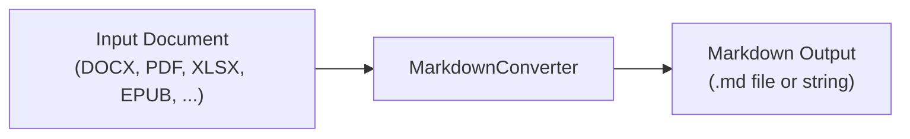

import Tabs from "@theme/Tabs";
import TabItem from "@theme/TabItem";

:::info
GroupDocs.Markdown for .NET is included in Conholdate.Total for .NET.
:::


This guide shows you how to convert documents to Markdown with GroupDocs.Markdown for .NET. You'll have working code in under 2 minutes.

### How it works





### Prerequisites

1. Install the NuGet package:

```bash
dotnet add package GroupDocs.Markdown
```

2. Add the namespace:
```csharp
using GroupDocs.Markdown;
```

### Example 1: Convert Word to Markdown

The simplest conversion - one line of code:


<Tabs groupId="qs-word-to-md">


<TabItem value="c" label="C#" default>

```csharp
using GroupDocs.Markdown;

// Convert a Word document to Markdown
string markdown = MarkdownConverter.ToMarkdown("business-plan.docx");

// Or save directly to a file
MarkdownConverter.ToFile("business-plan.docx", "qs-word-to-md.md");
```

</TabItem>


<TabItem value="business-plan-docx" label="business-plan.docx">

`business-plan.docx` is a sample file used in this example. Click [here](/net/markdown/_sample_files/business-plan.docx/) to download it.

</TabItem>


<TabItem value="qs-word-to-md-md" label="qs-word-to-md.md">

```text


</TabItem>


</Tabs>


### Example 2: Convert PDF with image export

Save a PDF to Markdown with images extracted to a folder:


<Tabs groupId="qs-pdf-with-images">


<TabItem value="c" label="C#" default>

```csharp
using GroupDocs.Markdown;

var options = new ConvertOptions
{
    ImageExportStrategy = new ExportImagesToFileSystemStrategy("output/images")
    {
        ImagesRelativePath = "images"
    }
};

MarkdownConverter.ToFile("business-plan.pdf", "output/report.md", options);
// Images saved to output/images/
// Markdown references: 
```

</TabItem>


<TabItem value="business-plan-pdf" label="business-plan.pdf">

`business-plan.pdf` is a sample file used in this example. Click [here](/net/markdown/_sample_files/business-plan.pdf/) to download it.

</TabItem>


<TabItem value="qs-pdf-with-images-zip" label="qs-pdf-with-images.zip">

```text
output/images/img-001.png (3 KB)
output/images/img-002.jpg (73 KB)
output/images/img-003.jpg (76 KB)
output/report.md (7 KB)
```
[Download full output](/net/markdown/_output_files/getting-started/quick-start-guide/QsPdfWithImages/qs-pdf-with-images.zip/)

</TabItem>


</Tabs>


### Example 3: Convert Excel with options

Convert a spreadsheet with column truncation and front matter:


<Tabs groupId="qs-excel-options">


<TabItem value="c" label="C#" default>

```csharp
using GroupDocs.Markdown;

var options = new ConvertOptions
{
    MaxColumns = 8,
    MaxRows = 50,
    IncludeFrontMatter = true,
    Flavor = MarkdownFlavor.GitHub
};

using var converter = new MarkdownConverter("cost-analysis.xlsx");

// Inspect before converting
DocumentInfo info = converter.GetDocumentInfo();
Console.WriteLine($"Worksheets: {info.PageCount}");

// Convert
ConvertResult result = converter.Convert("qs-excel-options.md", options);

// Check warnings
foreach (string w in result.Warnings)
    Console.WriteLine($"Warning: {w}");
```

</TabItem>


<TabItem value="cost-analysis-xlsx" label="cost-analysis.xlsx">

`cost-analysis.xlsx` is a sample file used in this example. Click [here](/net/markdown/_sample_files/cost-analysis.xlsx/) to download it.

</TabItem>


<TabItem value="qs-excel-options-md" label="qs-excel-options.md">

```text
---
format: Xlsx
pages: 4
---


## Summary

| Category | FY2024 | FY2025 | FY2026 |
| --- | --- | --- | --- |
[TRUNCATED]
```
[Download full output](/net/markdown/_output_files/getting-started/quick-start-guide/QsExcelOptions/qs-excel-options/)

</TabItem>


</Tabs>


### What's next?

- [Supported document formats](/net/markdown/getting-started/supported-document-formats/) - full list of input formats
- [Image handling strategies](/net/markdown/developer-guide/advanced-usage/strategy/) - Base64, file system, skip, custom
- [Markdown flavor control](/net/markdown/developer-guide/advanced-usage/markdown-flavor/) - GitHub vs CommonMark
- [YAML front matter](/net/markdown/developer-guide/advanced-usage/front-matter/) - for static site generators
