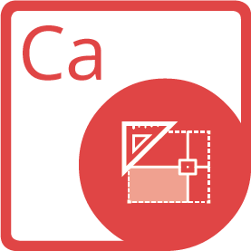

{}

**Welcome to Aspose.Words for Java**

Aspose.Words for Java is a class library that enables your applications to perform a great range of document processing tasks. Aspose.Words supports DOC, DOCX, RTF, HTML, OpenDocument, PDF, XPS, EPUB and other formats. With Aspose.Words you can generate, modify, convert, render and print documents without using Microsoft Word®.

{}

## **Aspose.Words for Java Resources**

The following are the links to some useful resources you may need to accomplish your tasks.

- [Aspose.Words for Java Features](https://docs.aspose.com/words/java/features/)
- [Aspose.Words for Java Release Notes](https://docs.aspose.com/words/java/release-notes/)
- [Aspose.Words for Java Product Page](https://products.aspose.com/words/java/)
- [Download Aspose.Words for Java](https://repository.aspose.com/webapp/#/artifacts/browse/tree/General/repo/com/aspose/aspose-words)
- [Install Aspose.Words for Java from Maven Repository](https://docs.aspose.com/words/java/installation/)
- [Aspose.Words for Java API Reference Guide](https://apireference.aspose.com/words/java)
- [Download Examples at GitHub Repository](https://github.com/aspose-words/Aspose.Words-for-Java)
- [Aspose.Words for Java Free Support Forum](https://forum.aspose.com/c/words/8)
- [Aspose.Words for Java Paid Support Helpdesk](https://helpdesk.aspose.com/)

{}

**Welcome to Aspose.PDF for Java**

Aspose.PDF is a Java component built to allow developers to create PDF documents, whether simple or complex, on the fly programmatically. Aspose.PDF for Java allows developers to insert tables, graphs, images, hyperlinks, custom fonts - and more - into PDF documents. Moreover, it is also possible to compress PDF documents. Aspose.PDF for Java provides excellent security features to develop secure PDF documents. And the most distinct feature of Aspose.PDF for Java is that it supports the creation of PDF documents through both an API and from XML templates

{}

## **Aspose.PDF for Java Resources**

The following are the links to some useful resources you may need to accomplish your tasks.

- [Aspose.PDF for Java Online Documentation](https://docs.aspose.com/pdf/java/)
- [Aspose.PDF for Java Features](https://docs.aspose.com/pdf/java/key-features/)
- [Aspose.PDF for Java Release Notes](https://docs.aspose.com/pdf/java/release-notes/)
- [Aspose.PDF for Java Product Page](https://products.aspose.com/pdf/java/)
- [Download Aspose.PDF for Java](https://repository.aspose.com/webapp/#/artifacts/browse/tree/General/repo/com/aspose/aspose-pdf)
- [Install Aspose.PDF for Java from Aspose Repository](https://docs.aspose.com/pdf/java/installation/)
- [Aspose.PDF for Java API Reference Guide](https://apireference.aspose.com/pdf/java)
- [Download Examples at GitHub Repository](https://github.com/aspose-pdf/Aspose.PDF-for-Java)
- [Aspose.PDF for Java Free Support Forum](https://forum.aspose.com/c/pdf/10)
- [Aspose.PDF for Java Paid Support Helpdesk](https://helpdesk.aspose.com/)

{}

**Welcome to Aspose.Cells for Java**

Aspose.Cells for Java is a class library that enables your applications to perform a great range of spreadsheet processing tasks. Aspose.Cells for Java supports the popular spreadsheet (XLS, XLSX, XLSM, XLSB, XLTX, XLTM, CSV, SpreadsheetML, ODS) file formats your business use every day. It also allows exporting Excel® files to PDF, XPS, HTML, MHTML, Plain Text and popular image formats including TIFF, JPG, PNG, BMP and SVG.

{}

## **Aspose.Cells for Java Resources**

The following are the links to some useful resources you may need to accomplish your tasks.

- [Aspose.Cells for Java Online Documentation](https://docs.aspose.com/cells/java/)
- [Aspose.Cells for Java Features](https://docs.aspose.com/cells/java/feature-overview/)
- [Aspose.Cells for Java Release Notes](https://docs.aspose.com/cells/java/release-notes/)
- [Aspose.Cells for Java Product Page](https://products.aspose.com/cells/java/)
- [Download Aspose.Cells for Java](https://repository.aspose.com/webapp/#/artifacts/browse/tree/General/repo/com/aspose/aspose-cells)
- [Install Aspose.Cells for Java from Maven Repository](https://docs.aspose.com/cells/java/installation/)
- [Aspose.Cells for Java API Reference Guide](https://apireference.aspose.com/cells/java)
- [Aspose.Cells for Java Free Support Forum](https://forum.aspose.com/c/cells/9)
- [Aspose.Cells for Java Paid Support Helpdesk](https://helpdesk.aspose.com/)

{}

Aspose.Email for Java is a Java API that enables Java applications to read and write Microsoft Outlook® documents without using Microsoft Outlook®. Aspose.Email for Java provides a number of key features such as managing recipients, subject, body, attachments in Microsoft Outlook® MSG documents and reading contacts, messages and folder information from Microsoft Outlook® PST documents. It can also be used to create, modify and convert email messages in EML, MSG and MHT formats.

{}

## **Aspose.Email for Java Resources**

The following are the links to some useful resources you may need to accomplish your tasks.

- [Aspose.Email for Java Online Documentation](https://docs.aspose.com/email/java/)
- [Aspose.Email for Java Features](https://docs.aspose.com/email/java/features-overview/)
- [Aspose.Email for Java Release Notes](https://docs.aspose.com/email/java/release-notes/)
- [Aspose.Email for Java Product Page](https://products.aspose.com/email/java/)
- [Install Aspose.Email for Java from Maven Repository](https://docs.aspose.com/email/java/installation/)
- [Aspose.Email for Java API Reference Guide](https://apireference.aspose.com/email/java)
- [Download Aspose.Email for Java from GitHub Repository](https://github.com/aspose-email/Aspose.Email-for-Java)
- [Aspose.Email for Java Free Support Forum](https://forum.aspose.com/c/email/12)
- [Aspose.Email for Java Paid Support Helpdesk](https://helpdesk.aspose.com/)

{}

**Welcome to Aspose.Slides for Java!**

Aspose.Slides for Java is a Microsoft PowerPoint® management API that enables Java applications to read and write PowerPoint® documents without Microsoft PowerPoint®. Aspose.Slides for Java is the first and only component that provides the functionality to manage PowerPoint® documents. Aspose.Slides for Java provides a lot of key features such as managing text, shapes, tables & animations, adding audio & video to slides, previewing slides, exporting slides to SVG, PDF and other formats.

{}

## **Aspose.Slides for Java Resources**

The following are the links to some useful resources you may need to accomplish your tasks.

- [Aspose.Slides for Java Online Documentation](https://docs.aspose.com/slides/java/)
- [Aspose.Slides for Java Features](https://docs.aspose.com/slides/java/aspose-slides-for-java-features/)
- [Aspose.Slides for Java Release Notes](https://docs.aspose.com/slides/java/release-notes/)
- [Aspose.Slides for Java Product Page](https://products.aspose.com/slides/java/)
- [Download Aspose.Slides for Java](https://repository.aspose.com/webapp/#/artifacts/browse/tree/General/repo/com/aspose/aspose-slides)
- [Install Aspose.Slides for Java from Maven Repository](https://docs.aspose.com/slides/java/installation/)
- [Aspose.Slides for Java API Reference Guide](https://apireference.aspose.com/slides/java)
- [Download Examples at GitHub Repository](https://github.com/aspose-slides/Aspose.Slides-for-Java)
- [Aspose.Slides for Java Free Support Forum](https://forum.aspose.com/c/slides/11)
- [Aspose.Slides for Java Paid Support Helpdesk](https://helpdesk.aspose.com/)

{}

**Welcome to Aspose.BarCode for Java**

Aspose.BarCode for Java is a robust and reliable barcode generation and recognition component, written in Java, it allows developers to quickly and easily add barcode generation and recognition functionality to their Java applications. It is available for the Java SE, Java EE and Java ME platforms.

Aspose.BarCode for Java supports most established barcode standards and barcode specifications. It has the ability to export to multiple image formats including: BMP, GIF, JPEG, PNG and TIFF.

This section introduces Aspose.BarCode for Java and its features, gives examples as case studies and lists some customers who choose to use Aspose.BarCode in their solutions. This section also includes information about Aspose.BarCode for Java [installation](https://docs.aspose.com/barcode/java/installation/), [evaluation](https://docs.aspose.com/barcode/java/installation/) and [licensing](https://docs.aspose.com/barcode/java/licensing/).

{}
## **Aspose.BarCode for Java Resources**
The following are the links to some useful resources you may need to accomplish your tasks.

- [Aspose.BarCode for Java Online Documentation](https://docs.aspose.com/barcode/java/)
- [Aspose.BarCode for Java Features](https://docs.aspose.com/barcode/java/product-overview/)
- [Aspose.BarCode for Java Release Notes](https://docs.aspose.com/barcode/java/release-notes/)
- [Aspose.BarCode for Java Product Page](https://products.aspose.com/barcode/java/)
- [Install Aspose.BarCode for Java from Maven Repository](https://docs.aspose.com/barcode/java/installation/)
- [Aspose.BarCode for Java API Reference Guide](https://apireference.aspose.com/barcode/java)
- [Download Aspose.BarCode for Java from GitHub Repository](https://github.com/aspose-barcode/Aspose.Barcode-for-Java)
- [Aspose.BarCode for Java Free Support Forum](https://forum.aspose.com/c/barcode/13)
- [Aspose.BarCode for Java Paid Support Helpdesk](https://helpdesk.aspose.com/)

{}

**Welcome to the Aspose.Imaging for Java documentation!**

Aspose.Imaging for Java is an easy-to-use, high-performance and well-documented imaging library. It provides the most flexible group of routines to create, manipulate and save images in Java applications. Aspose.Imaging for Java supports maximum file formats from Raster based graphical Imaging and provides a wide range of compression algorithms along with numerous image processing operations.

Aspose.Imaging for Java offers a broad spectrum of traditional image processing operations such as converting an image from one format to another, drawing native objects as well as GraphicsPaths and geometric transformations such as scaling, rotation and flipping. A demanding feature provided by Aspose.Imaging for Java is to manipulate multiple image frames or to read and write file formats which support multiple image frames.

{}

## **Aspose.Imaging for Java Resources**

The following are the links to some useful resources you may need to accomplish your tasks.

- [Aspose.Imaging for Java Online Documentation](https://docs.aspose.com/imaging/java/)
- [Aspose.Imaging for Java Features](https://docs.aspose.com/imaging/java/features/)
- [Aspose.Imaging for Java Release Notes](https://docs.aspose.com/imaging/java/release-notes/)
- [Aspose.Imaging for Java Product Page](https://products.aspose.com/imaging/java/)
- [Download Aspose.Imaging for Java](https://repository.aspose.com/webapp/#/artifacts/browse/tree/General/repo/com/aspose/aspose-imaging)
- [Install Aspose.Imaging for Java from Maven Repository](https://docs.aspose.com/imaging/java/installation/)
- [Aspose.Imaging for Java API Reference Guide](https://apireference.aspose.com/imaging/java)
- [Download Examples at GitHub Repository](https://github.com/aspose-imaging/Aspose.Imaging-for-Java)
- [Aspose.Imaging for Java Free Support Forum](https://forum.aspose.com/c/imaging/14)
- [Aspose.Imaging for Java Paid Support Helpdesk](https://helpdesk.aspose.com/)
## **Aspose.Tasks for Java**
{}

**Welcome to Aspose.Tasks for Java!**

Aspose.Tasks for Java is a class library that enables Java application developers to embed the functionality of processing Microsoft Project ® documents (MPP/MPT/XLS) without even using Microsoft Project®. The API, hence, eliminates the requirement of Microsoft Office Automation in such applications. Ported from its equivalent .NET product, Aspose.Tasks for Java is a mature product that offers stability and flexibility. The component provides an easy to use API for manipulating project files, saving time and money compared to developing similar features from scratch.

{}

## **Aspose.Tasks for Java Resources**

The following are the links to some useful resources you may need to accomplish your tasks.

- [Aspose.Tasks for Java Online Documentation](https://docs.aspose.com/tasks/java/)
- [Aspose.Tasks for Java Features](https://docs.aspose.com/tasks/java/product-overview/)
- [Aspose.Tasks for Java Release Notes](https://docs.aspose.com/tasks/java/release-notes/)
- [Aspose.Tasks for Java Product Page](https://products.aspose.com/tasks/java/)
- [Install Aspose.Tasks for Java from Maven Repository](https://docs.aspose.com/tasks/java/installation/)
- [Aspose.Tasks for Java API Reference Guide](https://apireference.aspose.com/tasks/java)
- [Download Aspose.Tasks for Java from GitHub Repository](https://github.com/aspose-tasks/Aspose.Tasks-for-Java)
- [Aspose.Tasks for Java Free Support Forum](https://forum.aspose.com/c/tasks/15)
- [Aspose.Tasks for Java Paid Support Helpdesk](https://helpdesk.aspose.com/)

{}

**Welcome to the Aspose.OCR for Java**

Aspose.OCR for Java is an optical character API that allows developers to add OCR functionality to their Java applications without requiring any additional tool or API. Aspose.OCR for Java allows extracting text from images having different fonts and styles - saving the time and effort involved in developing an OCR solution from scratch.

Aspose.OCR for Java comes with fully featured demos and working examples written in Java. The demos help developers learn about the component's features and get up and running quickly. Using Aspose.OCR for Java, developers can extract text and related information such as font, style & location of the text from specific parts of an image. This feature allows to perform the OCR operation quickly on document scans that follow the similar structure.

{}

## **Aspose.OCR for Java Resources**

The following are the links to some useful resources you may need to accomplish your tasks.

- [Aspose.OCR for Java Online Documentation](https://docs.aspose.com/ocr/java/)
- [Aspose.OCR for Java Features](https://docs.aspose.com/ocr/java/product-overview/)
- [Aspose.OCR for Java Release Notes](https://docs.aspose.com/ocr/java/release-notes/)
- [Aspose.OCR for Java Product Page](https://products.aspose.com/ocr/java/)
- [Install Aspose.OCR for Java from Maven Repository](https://docs.aspose.com/ocr/java/installation/)
- [Aspose.OCR for Java API Reference Guide](https://apireference.aspose.com/ocr/java)
- [Download Aspose.OCR for Java from GitHub Repository](https://github.com/aspose-ocr/Aspose.OCR-for-Java)
- [Aspose.OCR for Java Free Support Forum](https://forum.aspose.com/c/ocr/16)
- [Aspose.OCR for Java Paid Support Helpdesk](https://helpdesk.aspose.com/)

{}

**Welcome to Aspose.Diagram for Java**

Aspose.Diagram is the most flexible and reliable API that allows Java Applications to create and manage Microsoft Office Visio drawings without requiring Microsoft Office Visio to be installed on the system. It provides better performance and is easier to use to manipulate diagrams and convert files than Microsoft Office Automation.

Aspose.Diagram takes advantage of advanced functionality provided by Visio services to manipulate Visio documents on a server. Aspose.Diagram API is extensible, easy to use, compact and provides all the most common functionality so that developers can write less code.

{}

## **Aspose.Diagram for Java Resources**

The following are the links to some useful resources you may need to accomplish your tasks.

- [Aspose.Diagram for Java Online Documentation](https://docs.aspose.com/diagram/java/)
- [Aspose.Diagram for Java Features](https://docs.aspose.com/diagram/java/product-overview/#RichFeatures)
- [Aspose.Diagram for Java Release Notes](https://docs.aspose.com/diagram/java/release-notes/)
- [Aspose.Diagram for Java Product Page](https://products.aspose.com/diagram/java/)
- [Download Aspose.Diagram for Java](https://repository.aspose.com/webapp/#/artifacts/browse/tree/General/repo/com/aspose/aspose-diagram)
- [Install Aspose.Diagram for Java from Aspose Repository](https://docs.aspose.com/diagram/java/installation/)
- [Aspose.Diagram for Java API Reference Guide](https://apireference.aspose.com/diagram/java)
- [Download Examples at GitHub Repository](https://github.com/aspose-diagram/Aspose.Diagram-for-Java)
- [Aspose.Diagram for Java Free Support Forum](https://forum.aspose.com/c/diagram/17)
- [Aspose.Diagram for Java Paid Support Helpdesk](https://helpdesk.aspose.com/)

{}

[Aspose.Note for Java](https://products.aspose.com/note/java/) is a class library that enables Java applications to interact with Microsoft Office OneNote programmatically without the software being installed on the server. The Aspose.Note API lets developers read, convert, create, edit and manipulate the content of the Microsoft OneNote file format.

With Aspose.Note for Java, it is possible to program with Microsoft OneNote files without Microsoft Office Automation. The API is easy to use and saves time and money compared to developing similar solutions from scratch.

{}

## **Aspose.Note for Java Resources**

The following are the links to some useful resources you may need to accomplish your tasks.

- [Aspose.Note for Java Online Documentation](https://docs.aspose.com/note/java/)
- [Aspose.Tasks for Java Features](https://docs.aspose.com/note/java/product-overview/)
- [Aspose.Note for Java Release Notes](https://docs.aspose.com/note/java/release-notes/)
- [Aspose.Note for Java Product Page](https://products.aspose.com/note/java/)
- [Install Aspose.Note for Java from Maven Repository](https://docs.aspose.com/note/java/installation/)
- [Aspose.Note for Java API Reference Guide](https://apireference.aspose.com/note/java)
- [Download Aspose.Note for Java from GitHub Repository](https://github.com/aspose-note/Aspose.Note-for-Java)
- [Aspose.Note for Java Free Support Forum](https://forum.aspose.com/c/note/28)
- [Aspose.Note for Java Paid Support Helpdesk](https://helpdesk.aspose.com/)

{}

**Welcome to Aspose.CAD for Java**

Aspose.CAD for Java allows developers to convert AutoCAD DWG, DWF and DXF files to PDF and Raster images. It is a native API and does not require AutoCAD or any software to be installed.

You can also convert the selected layers and layouts from the AutoCAD files. The conversion to PDF and Raster images is of very high quality.

Using Aspose.CAD for Java in your project gives you the following benefits:

- Rich set of features
- Platform independence
- Performance and scalability
- Minimal learning curve

{}

## **Aspose.CAD for Java Resources**

The following are the links to some useful resources you may need to accomplish your tasks.

- [Aspose.CAD for Java Online Documentation](https://docs.aspose.com/cad/java/)
- [Aspose.CAD for Java Features](https://docs.aspose.com/cad/java/product-overview/#advanced-api-features)
- [Aspose.CAD for Java Release Notes](https://docs.aspose.com/cad/java/release-notes/)
- [Aspose.CAD for Java Product Page](https://products.aspose.com/cad/java/)
- [Download Aspose.CAD for Java](https://repository.aspose.com/webapp/#/artifacts/browse/tree/General/repo/com/aspose/aspose-cad)
- [Install Aspose.CAD for Java from Maven Repository](https://docs.aspose.com/cad/java/installation/)
- [Aspose.CAD for Java API Reference Guide](https://apireference.aspose.com/cad/java)
- [Download Examples at GitHub Repository](https://github.com/aspose-cad/Aspose.CAD-for-Java)
- [Aspose.CAD for Java Free Support Forum](https://forum.aspose.com/c/cad/19)
- [Aspose.CAD for Java Paid Support Helpdesk](https://helpdesk.aspose.com/)

{}

**Welcome to Aspose.HTML for Java**

Aspose.HTML for Java is an advanced HTML manipulation API built to perform a wide range of HTML manipulation tasks directly within the Java applications. The API also provides a high fidelity rendering engine for fixed-layout formats such as PDF & XPS, and a number of raster image formats.

{}

## **Aspose.HTML for Java Resources**

The following are the links to some useful resources you may need to accomplish your tasks.

- [Aspose.HTML for Java Online Documentation](https://docs.aspose.com/html/java/)
- [Aspose.HTML for Java Features](https://docs.aspose.com/html/java/getting-started/features-list/)
- [Aspose.HTML for Java Release Notes](https://docs.aspose.com/html/java/release-notes/)
- [Aspose.HTML for Java Product Page](https://products.aspose.com/html/java/)
- [Download Aspose.HTML for Java](https://repository.aspose.com/webapp/#/artifacts/browse/tree/General/repo/com/aspose/aspose-html)
- [Install Aspose.HTML for Java from Aspose Repository](https://docs.aspose.com/html/java/getting-started/installation/)
- [Aspose.HTML for Java API Reference Guide](https://apireference.aspose.com/html/java)
- [Download Examples at GitHub Repository](https://github.com/aspose-html/Aspose.HTML-for-Java)
- [Aspose.HTML for Java Free Support Forum](https://forum.aspose.com/c/html/29)
- [Aspose.HTML for Java Paid Support Helpdesk](https://helpdesk.aspose.com/)

{}

**Welcome to Aspose.3D for Java API**

Aspose.3D for Java API is built to create, edit, manipulate and save 3D formats. It empowers Java applications to connect with 3D documents without installing any software package on the computer. Aspose.3D for Java API assist developers to model and create massive worlds in games, superb scenes for design visualization, and engage virtual reality experiences.

The API is user friendly and saves time and money than creating a similar solution from scratch.

{}

## **Aspose.3D for Java Resources**

The following are the links to some useful resources you may need to accomplish your tasks.

- [Aspose.3D for Java Online Documentation](https://docs.aspose.com/3d/java/)
- [Aspose.3D for Java Features](https://docs.aspose.com/3d/java/product-overview/)
- [Aspose.3D for Java Release Notes](https://docs.aspose.com/3d/java/release-notes/)
- [Aspose.3D for Java Product Page](https://products.aspose.com/3d/java/)
- [Install Aspose.3D for Java from Aspose Artifactory](https://docs.aspose.com/3d/java/installation/)
- [Aspose.3D for Java API Reference Guide](https://apireference.aspose.com/3d/java)
- [Aspose.3D for Java Free Support Forum](https://forum.aspose.com/c/3d/18)
- [Aspose.3D for Java Paid Support Helpdesk](https://helpdesk.aspose.com/)

{}

****

**Welcome to the Aspose.Page for Java**

Aspose.Page is a Java API is built to allow developers to work with XPS and EPS/PS documents. Using the API you can create, edit and save existing as well as new XPS documents. Furthermore, you can convert XPS and EPS/PS documents to PDF and Images. It provides extensive manipulation capabilities and can be integrated with any kind of Desktop GUI Applications, Web Applications and Console Applications. 

{}

## **Aspose.Page for Java Resources**

The following are the links to some useful resources you may need to accomplish your tasks.

- [Aspose.Page for Java Online Documentation](https://docs.aspose.com/page/java/)
- [Aspose.Page for Java Features](https://docs.aspose.com/page/java/feature-list/)
- [Aspose.Page for Java Release Notes](https://docs.aspose.com/page/java/release-notes/)
- [Aspose.Page for Java Product Page](https://products.aspose.com/page/java/)
- [Install Aspose.Page for Java from Aspose Repository](https://docs.aspose.com/page/java/installation/)
- [Aspose.Page for Java Free Support Forum](https://forum.aspose.com/c/page/39)
- [Aspose.Page for Java Paid Support Helpdesk](https://helpdesk.aspose.com/)

{}

****

**Welcome to Aspose.PSD for Java**

Aspose.PSD for Java allows an extensive manipulation of PSD file formats. The product does not require Adobe Photoshop to be installed. Aspose.PSD for Java allows edit the PSD files, update layer properties, add watermarks, perform graphics operations and convert one file format into another. The product also supports different automation scenarios that help developers on their way.

Currently Aspose.PSD for Java supports PSD and PSB file formats for loading and manipulation. Future versions will allow loading of more PSD file formats. Aspose.PSD for Java allows export to various raster file formats such as TIFF, JPEG, JPEG2000, PNG, GIF and BMP. The product uses algorithms which allow perform editing of PSD files in an efficient way and maintain good performance. The product is actively being developed and many useful features will be added to meet the market demands.

{}

## **Aspose.PSD for Java Resources**

The following are the links to some useful resources you may need to accomplish your tasks.

- [Aspose.PSD for Java Online Documentation](https://docs.aspose.com/psd/java/)
- [Aspose.PSD for Java Features](https://docs.aspose.com/psd/java/features/)
- [Aspose.PSD for Java Release Notes](https://docs.aspose.com/psd/java/release-notes/)
- [Aspose.PSD for Java Product Page](https://products.aspose.com/psd/java/)
- [Download Aspose.PSD for Java](https://repository.aspose.com/webapp/#/artifacts/browse/tree/General/repo/com/aspose/aspose-psd)
- [Install Aspose.PSD for Java from Maven Repository](https://docs.aspose.com/psd/java/installation/)
- [Aspose.PSD for Java API Reference Guide](https://apireference.aspose.com/psd/java)
- [Download Examples at GitHub Repository](https://github.com/aspose-psd/Aspose.PSD-for-Java)
- [Aspose.PSD for Java Free Support Forum](https://forum.aspose.com/c/psd/34)
- [Aspose.PSD for Java Paid Support Helpdesk](https://helpdesk.aspose.com/)

{}

**Welcome to Aspose.PUB for Java**

Aspose.PUB for Java API lets you work with PUB files in your Java applications. It can read and convert .pub files to PDF file format without the need of installing any other software. You can, thus, focus on your application business logic instead of getting into the details of underlying file format. The API is light, easy to use and simplifies your application with simple lines of code in your application.

{}
## **Aspose.PUB for Java Resources**
The following are the links to some useful resources you may need to accomplish your tasks.

- [Aspose.PUB for Java Online Documentation](https://docs.aspose.com/pub/java/)
- [Aspose.PUB for Java Features](https://docs.aspose.com/pub/java/features/)
- [Aspose.PUB for Java Release Notes](https://docs.aspose.com/pub/java/release-notes/)
- [Aspose.PUB for Java Product Page](https://products.aspose.com/pub/java/)
- [Download Aspose.PUB for Java](https://repository.aspose.com/webapp/#/artifacts/browse/tree/General/repo/com/aspose/aspose-pub)
- [Aspose.PUB for Java API Reference Guide](https://apireference.aspose.com/pub/java)
- [Aspose.PUB for Java Free Support Forum](https://forum.aspose.com/c/pub/40)
- [Aspose.PUB for Java Paid Support Helpdesk](https://helpdesk.aspose.com/)

{}

****

**Welcome to Aspose.Font for Java**

Aspose.Font for Java is a font loading and drawing library. It supports multiple font formats such as TrueType (with TrueType collections), CFF, OpenType, and Type1. The API provides rich functionality to load/save font and provide information about its data structures along with any glyph that is supported by all the font types. It also provides encoding information for all the font types which represents a mapping between character codes and glyph identifiers. Its rendering subsystem helps end-users to render any desired glyph or text. Special glyphs can be rendered by implementing interface using simple graphics functionality (move point, draw line, curve).
{}

## **Aspose.Font for Java Resources**

The following are the links to some useful resources you may need to accomplish your tasks.

- [Aspose.Font for Java Online Documentation](https://docs.aspose.com/font/java/)
- [Aspose.Font for Java Features](https://docs.aspose.com/font/java/product-overview/)
- [Aspose.Font for Java Release Notes](https://docs.aspose.com/font/java/release-notes/)
- [Aspose.Font for Java Product Page](https://products.aspose.com/font/java/)
- [Aspose.Font for Java API Reference Guide](https://apireference.aspose.com/font/java)
- [Aspose.Font for Java Free Support Forum](https://forum.aspose.com/c/font/41)
- [Aspose.Font for Java Paid Support Helpdesk](https://helpdesk.aspose.com/)

{}

**Welcome to Aspose.TeX for Java**

Aspose.TeX is a Java library for TeX files typesetting. It can present TeX input in various graphic formats like XPS, PDF, PNG, JPEG, TIFF and BMP. It also outputs tracing info like any other TeX engine does. The API provides various ways of passing TeX input and obtaining output. And, as an advanced feature, it lets you create your own TeX format if you wish to typeset a number of documents designed uniformly.

{}

## **Aspose.TeX for Java Resources**

Following are the links to some useful resources you may need to accomplish your tasks.
- [Aspose.TeX for Java Online Documentation](https://docs.aspose.com/tex/java/)
- [Aspose.TeX for Java Features](https://docs.aspose.com/tex/java/feature-list/)
- [Aspose.TeX for Java Release Notes](https://docs.aspose.com/tex/java/release-notes/)
- [Aspose.TeX for Java Product Page](https://products.aspose.com/tex/java/)
- [Aspose.TeX for Java API Reference Guide](https://apireference.aspose.com/tex/java)
- [Aspose.TeX for Java Free Support Forum](https://forum.aspose.com/c/tex/47)
- [Aspose.TeX for Java Paid Support Helpdesk](https://helpdesk.aspose.com/)
