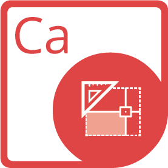

{}

**Добро пожаловать в Aspose.Words для Java**

Aspose.Words for Java — это библиотека классов, которая позволяет вашим приложениям выполнять широкий спектр задач по обработке документов. Aspose.Words поддерживает форматы DOC, DOCX, RTF, HTML, OpenDocument, PDF, XPS, EPUB и другие. С помощью Aspose.Words вы можете создавать, изменять, преобразовывать, визуализировать и печатать документы без использования Microsoft Word®.

{}

## **Aspose.Words для ресурсов Java**

Ниже приведены ссылки на некоторые полезные ресурсы, которые могут вам понадобиться для выполнения ваших задач.

- [Aspose.Words для функций Java] (https://docs.aspose.com/words/java/features/)
- [Примечания к выпуску Aspose.Words для Java](https://docs.aspose.com/words/java/release-notes/)
- [Страница продукта Aspose.Words для Java](https://products.aspose.com/words/java/)
- [Скачать Aspose.Words для Java](https://repository.aspose.com/webapp/#/artifacts/browse/tree/General/repo/com/aspose/aspose-words)
- [Установите Aspose.Words для Java из репозитория Maven] (https://docs.aspose.com/words/java/installation/)
- [Справочное руководство Aspose.Words для Java API](https://apireference.aspose.com/words/java)
- [Скачать примеры в репозитории GitHub] (https://github.com/aspose-words/Aspose.Words-for-Java)
- [Форум бесплатной поддержки Aspose.Words для Java](https://forum.aspose.com/c/words/8)
- [Aspose.Words для платной службы поддержки Java] (https://helpdesk.aspose.com/)

{}

**Добро пожаловать в Aspose.PDF для Java**

Aspose.PDF — это компонент Java, созданный для того, чтобы разработчики могли программно создавать PDF-документы, простые или сложные, на лету. Aspose.PDF для Java позволяет разработчикам вставлять таблицы, графики, изображения, гиперссылки, пользовательские шрифты и многое другое в документы PDF. Кроме того, PDF-документы также можно сжимать. Aspose.PDF для Java предоставляет отличные функции безопасности для разработки защищенных PDF-документов. И самая отличительная особенность Aspose.PDF для Java заключается в том, что он поддерживает создание документов PDF как через API, так и из шаблонов XML.

{}

## **Aspose.PDF для ресурсов Java**

Ниже приведены ссылки на некоторые полезные ресурсы, которые могут вам понадобиться для выполнения ваших задач.

- [Aspose.PDF для электронной документации по Java] (https://docs.aspose.com/pdf/java/)
- [Aspose.PDF для функций Java] (https://docs.aspose.com/pdf/java/key-features/)
- [Aspose.PDF для примечаний к выпуску Java] (https://docs.aspose.com/pdf/java/release-notes/)
- [Aspose.PDF для страницы продукта Java] (https://products.aspose.com/pdf/java/)
- [Скачать Aspose.PDF для Java] (https://repository.aspose.com/webapp/#/artifacts/browse/tree/General/repo/com/aspose/aspose-pdf)
- [Установить Aspose.PDF для Java из репозитория Aspose](https://docs.aspose.com/pdf/java/installation/)
- [Aspose.PDF для Справочного руководства по API Java] (https://apireference.aspose.com/pdf/java)
- [Скачать примеры в репозитории GitHub] (https://github.com/aspose-pdf/Aspose.PDF-for-Java)
- [Aspose.PDF для бесплатного форума поддержки Java] (https://forum.aspose.com/c/pdf/10)
- [Aspose.PDF для платной службы поддержки Java] (https://helpdesk.aspose.com/)

{}

**Добро пожаловать в Aspose.Cells для Java**

Aspose.Cells for Java — это библиотека классов, которая позволяет вашим приложениям выполнять широкий спектр задач по обработке электронных таблиц. Aspose.Cells для Java поддерживает популярные форматы файлов электронных таблиц (XLS, XLSX, XLSM, XLSB, XLTX, XLTM, CSV, SpreadsheetML, ODS), которые ваша компания использует каждый день. Он также позволяет экспортировать файлы Excel® в PDF, XPS, HTML, MHTML, обычный текст и популярные форматы изображений, включая TIFF, JPG, PNG, BMP и SVG.

{}

## **Aspose.Cells для ресурсов Java**

Ниже приведены ссылки на некоторые полезные ресурсы, которые могут вам понадобиться для выполнения ваших задач.

- [Онлайн-документация Aspose.Cells для Java](https://docs.aspose.com/cells/java/)
- [Aspose.Cells для функций Java] (https://docs.aspose.com/cells/java/feature-overview/)
- [Примечания к выпуску Aspose.Cells для Java](https://docs.aspose.com/cells/java/release-notes/)
- [Страница продукта Aspose.Cells для Java](https://products.aspose.com/cells/java/)
- [Скачать Aspose.Cells для Java](https://repository.aspose.com/webapp/#/artifacts/browse/tree/General/repo/com/aspose/aspose-cells)
- [Установить Aspose.Cells для Java из репозитория Maven](https://docs.aspose.com/cells/java/installation/)
- [Справочное руководство по API Aspose.Cells для Java](https://apireference.aspose.com/cells/java)
- [Форум бесплатной поддержки Aspose.Cells для Java](https://forum.aspose.com/c/cells/9)
- [Aspose.Cells для платной службы поддержки Java] (https://helpdesk.aspose.com/)

{}

Aspose.Email для Java — это Java API, который позволяет Java-приложениям читать и писать документы Microsoft Outlook® без использования Microsoft Outlook®. Aspose.Email для Java предоставляет ряд ключевых функций, таких как управление получателями, темой, телом, вложениями в документах Microsoft Outlook® MSG и чтение контактов, сообщений и информации о папках из документов Microsoft Outlook® PST. Его также можно использовать для создания, изменения и преобразования сообщений электронной почты в форматы EML, MSG и MHT.

{}

## **Aspose.Email для ресурсов Java**

Ниже приведены ссылки на некоторые полезные ресурсы, которые могут вам понадобиться для выполнения ваших задач.

- [Онлайн-документация Aspose.Email для Java] (https://docs.aspose.com/email/java/)
- [Функции Aspose.Email для Java](https://docs.aspose.com/email/java/features-overview/)
- [Примечания к выпуску Aspose.Email для Java](https://docs.aspose.com/email/java/release-notes/)
- [Страница продукта Aspose.Email для Java](https://products.aspose.com/email/java/)
- [Установите Aspose.Email для Java из репозитория Maven] (https://docs.aspose.com/email/java/installation/)
- [Справочное руководство по API Aspose.Email для Java](https://apireference.aspose.com/email/java)
- [Загрузить Aspose.Email для Java из репозитория GitHub] (https://github.com/aspose-email/Aspose.Email-for-Java)
- [Aspose.Email для бесплатного форума поддержки Java](https://forum.aspose.com/c/email/12)
- [Aspose.Email для платной службы поддержки Java] (https://helpdesk.aspose.com/)

{}

**Добро пожаловать в Aspose.Slides для Java!**

Aspose.Slides for Java — это API управления Microsoft PowerPoint®, который позволяет Java-приложениям читать и писать документы PowerPoint® без Microsoft PowerPoint®. Aspose.Slides for Java — это первый и единственный компонент, предоставляющий функциональные возможности для управления документами PowerPoint®. Aspose.Slides для Java предоставляет множество ключевых функций, таких как управление текстом, фигурами, таблицами и анимацией, добавление аудио и видео к слайдам, предварительный просмотр слайдов, экспорт слайдов в SVG, PDF и другие форматы.

{}

## **Aspose.Slides для ресурсов Java**

Ниже приведены ссылки на некоторые полезные ресурсы, которые могут вам понадобиться для выполнения ваших задач.

- [Aspose.Slides for Java Online Documentation](https://docs.aspose.com/slides/java/)
- [Aspose.Slides для функций Java] (https://docs.aspose.com/slides/java/aspose-slides-for-java-features/)
- [Примечания к выпуску Aspose.Slides для Java](https://docs.aspose.com/slides/java/release-notes/)
- [Страница продукта Aspose.Slides для Java](https://products.aspose.com/slides/java/)
- [Скачать Aspose.Slides для Java] (https://repository.aspose.com/webapp/#/artifacts/browse/tree/General/repo/com/aspose/aspose-slides)
- [Установите Aspose.Slides для Java из репозитория Maven] (https://docs.aspose.com/slides/java/installation/)
- [Справочное руководство по API Aspose.Slides для Java](https://apireference.aspose.com/slides/java)
- [Скачать примеры в репозитории GitHub] (https://github.com/aspose-slides/Aspose.Slides-for-Java)
- [Aspose.Slides for Java Free Support Forum](https://forum.aspose.com/c/slides/11)
- [Aspose.Slides для платной службы поддержки Java] (https://helpdesk.aspose.com/)

{}

**Добро пожаловать в Aspose.BarCode для Java**

Aspose.BarCode for Java — надежный компонент для генерации и распознавания штрих-кодов, написанный на Java. Он позволяет разработчикам быстро и легко добавлять функции генерации и распознавания штрих-кодов в свои Java-приложения. Он доступен для платформ Java SE, Java EE и Java ME.

Aspose.BarCode for Java поддерживает большинство установленных стандартов и спецификаций штрих-кодов. Он имеет возможность экспорта в несколько форматов изображений, включая: BMP, GIF, JPEG, PNG и TIFF.

В этом разделе рассказывается об Aspose.BarCode для Java и его функциях, приводятся примеры в качестве тематических исследований и перечислены некоторые клиенты, которые решили использовать Aspose.BarCode в своих решениях. В этом разделе также содержится информация об Aspose.BarCode для Java [установка](https://docs.aspose.com/barcode/java/installation/), [оценка](https://docs.aspose.com/barcode/java /установка/) и [лицензирование](https://docs.aspose.com/barcode/java/licensing/).

{}
## **Aspose.BarCode для ресурсов Java**
Ниже приведены ссылки на некоторые полезные ресурсы, которые могут вам понадобиться для выполнения ваших задач.

- [Онлайн-документация Aspose.BarCode для Java](https://docs.aspose.com/barcode/java/)
- [Функции Aspose.BarCode для Java](https://docs.aspose.com/barcode/java/product-overview/)
- [Примечания к выпуску Aspose.BarCode для Java](https://docs.aspose.com/barcode/java/release-notes/)
- [Страница продукта Aspose.BarCode для Java](https://products.aspose.com/barcode/java/)
- [Установите Aspose.BarCode для Java из репозитория Maven] (https://docs.aspose.com/barcode/java/installation/)
- [Aspose.BarCode for Java API Reference Guide](https://apireference.aspose.com/barcode/java)
- [Загрузить Aspose.BarCode для Java из репозитория GitHub] (https://github.com/aspose-barcode/Aspose.Barcode-for-Java)
- [Aspose.BarCode for Java Free Support Forum](https://forum.aspose.com/c/barcode/13)
- [Aspose.BarCode для платной службы поддержки Java] (https://helpdesk.aspose.com/)

{}

**Добро пожаловать в документацию Aspose.Imaging for Java!**

Aspose.Imaging for Java — это простая в использовании, высокопроизводительная и хорошо документированная библиотека изображений. Он предоставляет наиболее гибкую группу подпрограмм для создания, управления и сохранения изображений в приложениях Java. Aspose.Imaging for Java поддерживает максимальное количество форматов файлов графического изображения на основе растра и предоставляет широкий спектр алгоритмов сжатия наряду с многочисленными операциями обработки изображений.

Aspose.Imaging for Java предлагает широкий спектр традиционных операций обработки изображений, таких как преобразование изображения из одного формата в другой, рисование собственных объектов, а также GraphicsPaths и геометрические преобразования, такие как масштабирование, вращение и отражение. Требующая функция, предоставляемая Aspose.Imaging для Java, заключается в управлении несколькими кадрами изображений или в чтении и записи форматов файлов, которые поддерживают несколько кадров изображений.

{}

## **Aspose.Imaging для ресурсов Java**

Ниже приведены ссылки на некоторые полезные ресурсы, которые могут вам понадобиться для выполнения ваших задач.

- [Онлайн-документация Aspose.Imaging для Java](https://docs.aspose.com/imaging/java/)
- [Aspose.Imaging for Java Features](https://docs.aspose.com/imaging/java/features/)
- [Примечания к выпуску Aspose.Imaging for Java](https://docs.aspose.com/imaging/java/release-notes/)
- [Страница продукта Aspose.Imaging for Java](https://products.aspose.com/imaging/java/)
- [Загрузить Aspose.Imaging для Java] (https://repository.aspose.com/webapp/#/artifacts/browse/tree/General/repo/com/aspose/aspose-imaging)
- [Установите Aspose.Imaging for Java из репозитория Maven] (https://docs.aspose.com/imaging/java/installation/)
- [Справочное руководство Aspose.Imaging for Java API](https://apireference.aspose.com/imaging/java)
- [Скачать примеры в репозитории GitHub] (https://github.com/aspose-imaging/Aspose.Imaging-for-Java)
- [Aspose.Imaging for Java Free Support Forum](https://forum.aspose.com/c/imaging/14)
- [Aspose.Imaging для платной службы поддержки Java] (https://helpdesk.aspose.com/)
## **Aspose.Tasks для Java**
{}

**Добро пожаловать в Aspose.Tasks для Java!**

Aspose.Tasks for Java — это библиотека классов, которая позволяет разработчикам Java-приложений встраивать функции обработки документов Microsoft Project® (MPP/MPT/XLS) даже без использования Microsoft Project®. Таким образом, API устраняет необходимость использования Microsoft Office Automation в таких приложениях. Aspose.Tasks for Java, перенесенный из эквивалентного продукта .NET, представляет собой зрелый продукт, обеспечивающий стабильность и гибкость. Компонент предоставляет простой в использовании API для управления файлами проекта, экономя время и деньги по сравнению с разработкой аналогичных функций с нуля.

{}

## **Aspose.Tasks для ресурсов Java**

Ниже приведены ссылки на некоторые полезные ресурсы, которые могут вам понадобиться для выполнения ваших задач.

- [Aspose.Tasks для электронной документации по Java] (https://docs.aspose.com/tasks/java/)
- [Aspose.Tasks для функций Java] (https://docs.aspose.com/tasks/java/product-overview/)
- [Aspose.Tasks for Java Release Notes](https://docs.aspose.com/tasks/java/release-notes/)
- [Страница продукта Aspose.Tasks для Java](https://products.aspose.com/tasks/java/)
- [Установить Aspose.Tasks для Java из репозитория Maven] (https://docs.aspose.com/tasks/java/installation/)
- [Справочное руководство Aspose.Tasks для Java API](https://apireference.aspose.com/tasks/java)
- [Загрузить Aspose.Tasks для Java из репозитория GitHub] (https://github.com/aspose-tasks/Aspose.Tasks-for-Java)
- [Aspose.Tasks для бесплатного форума поддержки Java](https://forum.aspose.com/c/tasks/15)
- [Aspose.Tasks для платной службы поддержки Java] (https://helpdesk.aspose.com/)

{}

**Добро пожаловать в Aspose.OCR для Java**

Aspose.OCR для Java — это API-интерфейс оптических символов, который позволяет разработчикам добавлять функции распознавания текста в свои Java-приложения, не требуя каких-либо дополнительных инструментов или API. Aspose.OCR для Java позволяет извлекать текст из изображений с разными шрифтами и стилями, экономя время и усилия, необходимые для разработки решения OCR с нуля.

Aspose.OCR для Java поставляется с полнофункциональными демонстрациями и рабочими примерами, написанными на Java. Демонстрации помогают разработчикам узнать о функциях компонента и быстро приступить к работе. Используя Aspose.OCR для Java, разработчики могут извлекать текст и сопутствующую информацию, такую как шрифт, стиль и местоположение текста, из определенных частей изображения. Эта функция позволяет быстро выполнять операцию OCR на отсканированных документах с аналогичной структурой.

{}

## **Aspose.OCR для ресурсов Java**

Ниже приведены ссылки на некоторые полезные ресурсы, которые могут вам понадобиться для выполнения ваших задач.

- [Aspose.OCR для электронной документации по Java] (https://docs.aspose.com/ocr/java/)
- [Функции Aspose.OCR для Java](https://docs.aspose.com/ocr/java/product-overview/)
- [Примечания к выпуску Aspose.OCR для Java](https://docs.aspose.com/ocr/java/release-notes/)
- [Страница продукта Aspose.OCR для Java](https://products.aspose.com/ocr/java/)
- [Установите Aspose.OCR для Java из репозитория Maven] (https://docs.aspose.com/ocr/java/installation/)
- [Справочное руководство по API Aspose.OCR для Java](https://apireference.aspose.com/ocr/java)
- [Загрузить Aspose.OCR для Java из репозитория GitHub] (https://github.com/aspose-ocr/Aspose.OCR-for-Java)
- [Aspose.OCR для бесплатного форума поддержки Java](https://forum.aspose.com/c/ocr/16)
- [Aspose.OCR для платной службы поддержки Java] (https://helpdesk.aspose.com/)

{}

**Добро пожаловать в Aspose.Diagram для Java**

Aspose.Diagram — это наиболее гибкий и надежный API, который позволяет Java-приложениям создавать и управлять чертежами Microsoft Office Visio, не требуя установки Microsoft Office Visio в системе. Он обеспечивает более высокую производительность и проще в использовании для управления диаграммами и преобразования файлов, чем Microsoft Office Automation.

Aspose.Diagram использует расширенные функции, предоставляемые службами Visio, для управления документами Visio на сервере. Aspose.Diagram API является расширяемым, простым в использовании, компактным и предоставляет все наиболее распространенные функции, чтобы разработчики могли писать меньше кода.

{}

## **Aspose.Diagram для ресурсов Java**

Ниже приведены ссылки на некоторые полезные ресурсы, которые могут вам понадобиться для выполнения ваших задач.

- [Aspose.Diagram для электронной документации по Java] (https://docs.aspose.com/diagram/java/)
- [Aspose.Diagram для функций Java] (https://docs.aspose.com/diagram/java/product-overview/#RichFeatures)
- [Aspose.Diagram для примечаний к выпуску Java](https://docs.aspose.com/diagram/java/release-notes/)
- [Aspose.Diagram для страницы продукта Java](https://products.aspose.com/diagram/java/)
- [Скачать Aspose.Diagram для Java] (https://repository.aspose.com/webapp/#/artifacts/browse/tree/General/repo/com/aspose/aspose-diagram)
- [Установить Aspose.Diagram для Java из репозитория Aspose](https://docs.aspose.com/diagram/java/installation/)
- [Aspose.Diagram для справочника API Java](https://apireference.aspose.com/diagram/java)
- [Скачать примеры в репозитории GitHub] (https://github.com/aspose-diagram/Aspose.Diagram-for-Java)
- [Aspose.Diagram для бесплатного форума поддержки Java](https://forum.aspose.com/c/diagram/17)
- [Aspose.Diagram для платной службы поддержки Java] (https://helpdesk.aspose.com/)

{}

[Aspose.Note для Java](https://products.aspose.com/note/java/) — это библиотека классов, которая позволяет Java-приложениям программно взаимодействовать с Microsoft Office OneNote без установки программного обеспечения на сервер. API Aspose.Note позволяет разработчикам читать, преобразовывать, создавать, редактировать и манипулировать содержимым формата файлов Microsoft OneNote.

С Aspose.Note для Java можно программировать файлы Microsoft OneNote без автоматизации Microsoft Office. API прост в использовании и экономит время и деньги по сравнению с разработкой аналогичных решений с нуля.

{}

## **Aspose.Note для ресурсов Java**

Ниже приведены ссылки на некоторые полезные ресурсы, которые могут вам понадобиться для выполнения ваших задач.

- [Онлайн-документация Aspose.Note для Java] (https://docs.aspose.com/note/java/)
- [Aspose.Tasks для функций Java](https://docs.aspose.com/note/java/product-overview/)
- [Примечания к выпуску Aspose.Note для Java](https://docs.aspose.com/note/java/release-notes/)
- [Страница продукта Aspose.Note для Java](https://products.aspose.com/note/java/)
- [Установите Aspose.Note для Java из репозитория Maven] (https://docs.aspose.com/note/java/installation/)
- [Справочное руководство по API Aspose.Note для Java](https://apireference.aspose.com/note/java)
- [Загрузить Aspose.Note для Java из репозитория GitHub] (https://github.com/aspose-note/Aspose.Note-for-Java)
- [Aspose.Note for Java Free Support Forum](https://forum.aspose.com/c/note/28)
- [Aspose.Note для платной службы поддержки Java] (https://helpdesk.aspose.com/)

{}

**Добро пожаловать в Aspose.CAD для Java**

Aspose.CAD для Java позволяет разработчикам преобразовывать файлы AutoCAD DWG, DWF и DXF в PDF и растровые изображения. Это собственный API, не требующий установки AutoCAD или какого-либо программного обеспечения.

Вы также можете преобразовать выбранные слои и макеты из файлов AutoCAD. Преобразование в PDF и растровые изображения очень высокого качества.

Использование Aspose.CAD для Java в вашем проекте дает вам следующие преимущества:

- Богатый набор функций
- Независимость от платформы
- Производительность и масштабируемость
- Минимальная кривая обучения

{}

## **Aspose.CAD для ресурсов Java**

Ниже приведены ссылки на некоторые полезные ресурсы, которые могут вам понадобиться для выполнения ваших задач.

- [Онлайн-документация Aspose.CAD для Java](https://docs.aspose.com/cad/java/)
- [Функции Aspose.CAD для Java](https://docs.aspose.com/cad/java/product-overview/#advanced-api-features)
- [Примечания к выпуску Aspose.CAD для Java](https://docs.aspose.com/cad/java/release-notes/)
- [Страница продукта Aspose.CAD для Java](https://products.aspose.com/cad/java/)
- [Скачать Aspose.CAD для Java] (https://repository.aspose.com/webapp/#/artifacts/browse/tree/General/repo/com/aspose/aspose-cad)
- [Установите Aspose.CAD для Java из репозитория Maven] (https://docs.aspose.com/cad/java/installation/)
- [Справочное руководство Aspose.CAD для Java API](https://apireference.aspose.com/cad/java)
- [Загрузить примеры в репозитории GitHub] (https://github.com/aspose-cad/Aspose.CAD-for-Java)
- [Форум бесплатной поддержки Aspose.CAD для Java](https://forum.aspose.com/c/cad/19)
- [Aspose.CAD для платной службы поддержки Java] (https://helpdesk.aspose.com/)

{}

**Добро пожаловать в Aspose.HTML для Java**

Aspose.HTML для Java — это расширенный API для работы с HTML, созданный для выполнения широкого спектра задач по работе с HTML непосредственно в приложениях Java. API также предоставляет высокоточный механизм рендеринга для форматов с фиксированным макетом, таких как PDF и XPS, а также для ряда форматов растровых изображений.

{}

## **Aspose.HTML для ресурсов Java**

Ниже приведены ссылки на некоторые полезные ресурсы, которые могут вам понадобиться для выполнения ваших задач.

- [Aspose.HTML для интерактивной документации по Java](https://docs.aspose.com/html/java/)
- [Aspose.HTML для функций Java](https://docs.aspose.com/html/java/getting-started/features-list/)
- [Примечания к выпуску Aspose.HTML для Java](https://docs.aspose.com/html/java/release-notes/)
- [Страница продукта Aspose.HTML для Java](https://products.aspose.com/html/java/)
- [Скачать Aspose.HTML для Java](https://repository.aspose.com/webapp/#/artifacts/browse/tree/General/repo/com/aspose/aspose-html)
- [Установите Aspose.HTML для Java из репозитория Aspose](https://docs.aspose.com/html/java/getting-started/installation/)
- [Aspose.HTML для Справочного руководства по API Java](https://apireference.aspose.com/html/java)
- [Скачать примеры в репозитории GitHub] (https://github.com/aspose-html/Aspose.HTML-for-Java)
- [Aspose.HTML для бесплатного форума поддержки Java](https://forum.aspose.com/c/html/29)
- [Aspose.HTML для платной службы поддержки Java](https://helpdesk.aspose.com/)

{}

**Добро пожаловать в Aspose.3D для Java API**

Aspose.3D for Java API создан для создания, редактирования, управления и сохранения 3D-форматов. Он позволяет приложениям Java подключаться к 3D-документам без установки какого-либо программного пакета на компьютер. Aspose.3D для Java API помогает разработчикам моделировать и создавать огромные миры в играх, превосходные сцены для визуализации дизайна и использовать возможности виртуальной реальности.

API удобен для пользователя и экономит время и деньги, чем создание аналогичного решения с нуля.

{}

## **Aspose.3D для ресурсов Java**

Ниже приведены ссылки на некоторые полезные ресурсы, которые могут вам понадобиться для выполнения ваших задач.

- [Онлайн-документация Aspose.3D для Java] (https://docs.aspose.com/3d/java/)
- [Функции Aspose.3D для Java](https://docs.aspose.com/3d/java/product-overview/)
- [Примечания к выпуску Aspose.3D для Java](https://docs.aspose.com/3d/java/release-notes/)
- [Страница продукта Aspose.3D для Java](https://products.aspose.com/3d/java/)
- [Установите Aspose.3D для Java из Aspose Artifactory](https://docs.aspose.com/3d/java/installation/)
- [Справочное руководство Aspose.3D для Java API](https://apireference.aspose.com/3d/java)
- [Форум бесплатной поддержки Aspose.3D для Java](https://forum.aspose.com/c/3d/18)
- [Aspose.3D для платной службы поддержки Java] (https://helpdesk.aspose.com/)

{}

** **

**Добро пожаловать на страницу Aspose.Page для Java**

Aspose.Page — это Java API, созданный для того, чтобы разработчики могли работать с документами XPS и EPS/PS. Используя API, вы можете создавать, редактировать и сохранять как существующие, так и новые документы XPS. Кроме того, вы можете конвертировать документы XPS и EPS/PS в PDF и изображения. Он предоставляет широкие возможности манипулирования и может быть интегрирован с любым типом настольных приложений с графическим интерфейсом, веб-приложениями и консольными приложениями.

{}

## **Aspose.Page для ресурсов Java**

Ниже приведены ссылки на некоторые полезные ресурсы, которые могут вам понадобиться для выполнения ваших задач.

- [Aspose.Page для онлайн-документации по Java] (https://docs.aspose.com/page/java/)
- [Aspose.Page для функций Java] (https://docs.aspose.com/page/java/feature-list/)
- [Примечания к выпуску Aspose.Page для Java](https://docs.aspose.com/page/java/release-notes/)
- [Aspose.Page для страницы продукта Java] (https://products.aspose.com/page/java/)
- [Установить Aspose.Page для Java из репозитория Aspose](https://docs.aspose.com/page/java/installation/)
- [Aspose.Page для бесплатного форума поддержки Java](https://forum.aspose.com/c/page/39)
- [Aspose.Page для платной службы поддержки Java] (https://helpdesk.aspose.com/)

{}

** **

**Добро пожаловать в Aspose.PSD для Java**

Aspose.PSD для Java позволяет обширно манипулировать форматами файлов PSD. Продукт не требует установки Adobe Photoshop. Aspose.PSD для Java позволяет редактировать файлы PSD, обновлять свойства слоя, добавлять водяные знаки, выполнять графические операции и преобразовывать один формат файла в другой. Продукт также поддерживает различные сценарии автоматизации, помогающие разработчикам.

В настоящее время Aspose.PSD для Java поддерживает форматы файлов PSD и PSB для загрузки и обработки. Будущие версии позволят загружать больше форматов файлов PSD. Aspose.PSD для Java позволяет экспортировать в различные форматы растровых файлов, такие как TIFF, JPEG, JPEG2000, PNG, GIF и BMP. Продукт использует алгоритмы, которые позволяют эффективно редактировать файлы PSD и поддерживать хорошую производительность. Продукт активно развивается, и для удовлетворения потребностей рынка будет добавлено множество полезных функций.

{}

## **Aspose.PSD для ресурсов Java**

Ниже приведены ссылки на некоторые полезные ресурсы, которые могут вам понадобиться для выполнения ваших задач.

- [Aspose.PSD для онлайн-документации по Java] (https://docs.aspose.com/psd/java/)
- [Aspose.PSD для функций Java] (https://docs.aspose.com/psd/java/features/)
- [Aspose.PSD для примечаний к выпуску Java](https://docs.aspose.com/psd/java/release-notes/)
- [Страница продукта Aspose.PSD для Java](https://products.aspose.com/psd/java/)
- [Скачать Aspose.PSD для Java] (https://repository.aspose.com/webapp/#/artifacts/browse/tree/General/repo/com/aspose/aspose-psd)
- [Установите Aspose.PSD для Java из репозитория Maven] (https://docs.aspose.com/psd/java/installation/)
- [Aspose.PSD для Справочного руководства по API Java] (https://apireference.aspose.com/psd/java)
- [Скачать примеры в репозитории GitHub] (https://github.com/aspose-psd/Aspose.PSD-for-Java)
- [Aspose.PSD для бесплатного форума поддержки Java](https://forum.aspose.com/c/psd/34)
- [Aspose.PSD для платной службы поддержки Java] (https://helpdesk.aspose.com/)

{}

**Добро пожаловать в Aspose.PUB для Java**

Aspose.PUB for Java API позволяет вам работать с файлами PUB в ваших приложениях Java. Он может читать и конвертировать файлы .pub в формат PDF без необходимости установки какого-либо другого программного обеспечения. Таким образом, вы можете сосредоточиться на бизнес-логике вашего приложения, вместо того чтобы вдаваться в подробности базового формата файла. API легкий, простой в использовании и упрощает ваше приложение с помощью простых строк кода в вашем приложении.

{}
## **Aspose.PUB для ресурсов Java**
Ниже приведены ссылки на некоторые полезные ресурсы, которые могут вам понадобиться для выполнения ваших задач.

- [Aspose.PUB для онлайн-документации по Java] (https://docs.aspose.com/pub/java/)
- [Aspose.PUB для функций Java] (https://docs.aspose.com/pub/java/features/)
- [Примечания к выпуску Aspose.PUB для Java](https://docs.aspose.com/pub/java/release-notes/)
- [Страница продукта Aspose.PUB для Java](https://products.aspose.com/pub/java/)
- [Скачать Aspose.PUB для Java] (https://repository.aspose.com/webapp/#/artifacts/browse/tree/General/repo/com/aspose/aspose-pub)
- [Справочное руководство Aspose.PUB для Java API](https://apireference.aspose.com/pub/java)
- [Aspose.PUB для бесплатного форума поддержки Java](https://forum.aspose.com/c/pub/40)
- [Aspose.PUB для платной службы поддержки Java] (https://helpdesk.aspose.com/)

{}

** **

**Добро пожаловать в Aspose.Font для Java**

Aspose.Font для Java — это библиотека для загрузки и рисования шрифтов. Он поддерживает несколько форматов шрифтов, таких как TrueType (с коллекциями TrueType), CFF, OpenType и Type1. API предоставляет широкие возможности для загрузки/сохранения шрифта и предоставления информации о его структурах данных вместе с любым глифом, который поддерживается всеми типами шрифтов. Он также предоставляет информацию о кодировке для всех типов шрифтов, которая представляет сопоставление между кодами символов и идентификаторами глифов. Его подсистема рендеринга помогает конечным пользователям отображать любой желаемый глиф или текст. Специальные глифы могут отображаться путем реализации интерфейса с использованием простых графических функций (переместить точку, нарисовать линию, кривую).
{}

## **Aspose.Font для ресурсов Java**

Ниже приведены ссылки на некоторые полезные ресурсы, которые могут вам понадобиться для выполнения ваших задач.

- [Онлайн-документация Aspose.Font для Java](https://docs.aspose.com/font/java/)
- [Функции Aspose.Font для Java](https://docs.aspose.com/font/java/product-overview/)
- [Примечания к выпуску Aspose.Font для Java](https://docs.aspose.com/font/java/release-notes/)
- [Страница продукта Aspose.Font для Java](https://products.aspose.com/font/java/)
- [Справочное руководство по API Aspose.Font для Java](https://apireference.aspose.com/font/java)
- [Aspose.Font for Java Free Support Forum](https://forum.aspose.com/c/font/41)
- [Aspose.Font для платной службы поддержки Java] (https://helpdesk.aspose.com/)

{}

**Добро пожаловать в Aspose.TeX для Java**

Aspose.TeX — это библиотека Java для набора файлов TeX. Он может представлять ввод TeX в различных графических форматах, таких как XPS, PDF, PNG, JPEG, TIFF и BMP. Он также выводит информацию о трассировке, как это делает любой другой движок TeX. API предоставляет различные способы передачи входных данных TeX и получения выходных данных. И, как дополнительная функция, он позволяет вам создавать свой собственный формат TeX, если вы хотите набирать несколько документов, оформленных единообразно.

{}

## **Aspose.TeX для ресурсов Java**

Ниже приведены ссылки на некоторые полезные ресурсы, которые могут вам понадобиться для выполнения ваших задач.
- [Онлайн-документация Aspose.TeX для Java](https://docs.aspose.com/tex/java/)
- [Aspose.TeX для функций Java] (https://docs.aspose.com/tex/java/feature-list/)
- [Примечания к выпуску Aspose.TeX для Java](https://docs.aspose.com/tex/java/release-notes/)
- [Страница продукта Aspose.TeX для Java](https://products.aspose.com/tex/java/)
- [Справочное руководство по API Aspose.TeX для Java](https://apireference.aspose.com/tex/java)
- [Aspose.TeX for Java Free Support Forum](https://forum.aspose.com/c/tex/47)
- [Aspose.TeX для платной службы поддержки Java] (https://helpdesk.aspose.com/)

