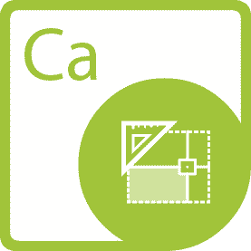

{} 

**欢迎使用 Aspose.Words for .NET**

Aspose.Words for .NET 是一个类库，使您的应用程序能够执行大量文档处理任务。 Aspose.Words 支持 DOC、DOCX、RTF、HTML、OpenDocument、PDF、XPS、EPUB 等格式。使用 Aspose.Words，您可以在不使用 Microsoft Word® 的情况下生成、修改、转换、渲染和打印文档。

{} 

## **Aspose.Words for .NET 资源**

以下是您完成任务可能需要的一些有用资源的链接。

- [Aspose.Words for .NET 在线文档](https://docs.aspose.com/words/net/)
- [Aspose.Words for .NET 功能](https://docs.aspose.com/words/net/feature-overview)
- [Aspose.Words for .NET 限制](https://docs.aspose.com/words/net/what-document-features-are-supported)
- [Aspose.Words for .NET 发行说明](https://docs.aspose.com/words/net/release-notes/)
- [Aspose.Words for .NET 产品页面](https://products.aspose.com/words/net)
- [下载 Aspose.Words for .NET](https://downloads.aspose.com/words/net)
- [为 .NET NuGet 包安装 Aspose.Words](https://www.nuget.org/packages/Aspose.Words/)
- [Aspose.Words for .NET API 参考指南](https://apireference.aspose.com/net/words)
- [在 GitHub 存储库下载示例](https://github.com/aspose-words/Aspose.Words-for-.NET)
- [Aspose.Words for .NET 免费支持论坛](https://forum.aspose.com/c/words)
- [Aspose.Words for .NET 付费支持帮助台](https://helpdesk.aspose.com/)

{} 

**欢迎使用 Aspose.PDF for .NET**

Aspose.PDF 是一个 .NET 组件，允许开发人员以编程方式即时创建简单或复杂的 PDF 文档。 Aspose.PDF for .NET 允许开发人员在 PDF 文档中插入表格、图表、图像、超链接、自定义字体等。此外，还可以压缩 PDF 文档。 Aspose.PDF for .NET 提供了出色的安全功能来开发安全的 PDF 文档。 Aspose.PDF for .NET 最显着的特点是它支持通过 API 和 XML 模板创建 PDF 文档。

{} 

## **Aspose.PDF for .NET 资源**

以下是您完成任务可能需要的一些有用资源的链接。

- [Aspose.PDF for .NET 在线文档](https://docs.aspose.com/pdf/net/)
- [Aspose.PDF for .NET Features](https://docs.aspose.com/pdf/net/feature-list)
- [Aspose.PDF for .NET 发行说明](https://docs.aspose.com/pdf/net/release-notes/)
- [Aspose.PDF for .NET 产品页面](https://products.aspose.com/pdf/net)
- [为 .NET NuGet 包安装 Aspose.PDF](https://www.nuget.org/packages/Aspose.PDF/)
- [Aspose.PDF for .NET API 参考指南](https://apireference.aspose.com/net/pdf)
- [Aspose.PDF for .NET 免费支持论坛](https://forum.aspose.com/c/pdf)
- [Aspose.PDF for .NET 付费支持帮助台](https://helpdesk.aspose.com/)

{} 

**欢迎使用 Aspose.Cells for .NET**

Aspose.Cells for .NET 是一个电子表格编程库，允许软件开发人员在他们自己的应用程序中操作和转换电子表格文件。 Aspose.Cells for .NET 结合了 API 和 GUI 控件，可加速 Microsoft Excel® 编程和转换。 Aspose.Cells for .NET 支持您的企业日常使用的流行电子表格（XLS、XLSX、XLSM、XLSB、XLTX、XLTM、CSV、SpreadsheetML、ODS）文件格式。它还允许将 Excel 文件导出为 PDF、XPS、HTML、MHTML、纯文本和流行的图像格式，包括 TIFF、JPG、PNG、BMP 和 SVG。

{} 

## **Aspose.Cells for .NET 资源**

以下是您完成任务可能需要的一些有用资源的链接。

- [Aspose.Cells for .NET 在线文档](https://docs.aspose.com/cells/net/)
- [Aspose.Cells for .NET 功能](https://docs.aspose.com/cells/net/feature-overview/)
- [Aspose.Cells for .NET 限制](https://docs.aspose.com/cells/net/what-document-features-are-supported/)
- [Aspose.Cells for .NET 发行说明](https://docs.aspose.com/cells/net/release-notes/)
- [Aspose.Cells for .NET 产品页面](https://products.aspose.com/cells/net)
- [为 .NET NuGet 包安装 Aspose.Cells](https://www.nuget.org/packages/Aspose.Cells/)
- [Aspose.Cells for .NET API 参考指南](https://apireference.aspose.com/cells/net)
- [Aspose.Cells for .NET 免费支持论坛](https://forum.aspose.com/c/cells)
- [Aspose.Cells for .NET 付费支持帮助台](https://helpdesk.aspose.com/)

{} 

**欢迎使用 Aspose.Email for .NET**

Aspose.Email for .NET 是一套灵活且易于使用的 .NET 类库，它们结合在一起产生了最独特和最强大的电子邮件编程组件。 Aspose.Email 允许您快速轻松地将复杂的消息文件处理编码到您的应用程序中，从而节省您的时间和精力。

Aspose.Email 实现了许多网络协议，例如 SMTP、MIME、POP3、IMAP；消息文件格式，例如 EML、MSG、MHT； PST、MBOX等邮件存储格式；和 Exchange 服务器，允许开发人员创建各种电子邮件处理应用程序。 Aspose.Email 帮助开发人员编程，而不会迷失在消息格式细节的复杂性中。

{} 

## **Aspose.Email 用于 .NET 资源**

以下是您完成任务可能需要的一些有用资源的链接。

- [Aspose.Email for .NET 在线文档](https://docs.aspose.com/email/net/)
- [Aspose.Email for .NET 功能](https://docs.aspose.com/email/net/features-overview)
- [Aspose.Email for .NET 发行说明](https://docs.aspose.com/email/net/release-notes/)
- [Aspose.Email for .NET 产品页面](https://products.aspose.com/email/net)
- [为 .NET NuGet 包安装 Aspose.Email](https://www.nuget.org/packages/Aspose.Email/)
- [Aspose.Email for .NET API 参考指南](https://apireference.aspose.com/net/email)
- [Aspose.Email for .NET 免费支持论坛](https://forum.aspose.com/c/email)
- [Aspose.Email for .NET 付费支持帮助台](https://helpdesk.aspose.com/)

{} 

**欢迎使用 Aspose.Slides for .NET**

Aspose.Slides for .NET 是一个 Microsoft PowerPoint® 管理 API，它使 .NET 应用程序能够在不使用 Microsoft PowerPoint® 的情况下读取和写入 PowerPoint® 文档。 Aspose.Slides for .NET 是第一个也是唯一一个提供管理 PowerPoint® 文档功能的组件。 Aspose.Slides for .NET 提供了许多关键功能，例如管理文本、形状、表格和动画、向幻灯片添加音频和视频、预览幻灯片、将幻灯片导出为 SVG、PDF 格式等等。

{} 

## **Aspose.Slides 用于 .NET 资源**

以下是您完成任务可能需要的一些有用资源的链接。

- [Aspose.Slides for .NET 在线文档](https://docs.aspose.com/slides/net/)
- [Aspose.Slides for .NET 功能](https://docs.aspose.com/slides/net/features-overview)
- [Aspose.Slides for .NET 限制](https://docs.aspose.com/slides/net/known-issues)
- [Aspose.Slides for .NET 发行说明](https://docs.aspose.com/slides/net/release-notes/)
- [Aspose.Slides for .NET 产品页面](https://products.aspose.com/slides/net)
- [为 .NET NuGet 包安装 Aspose.Slides](https://www.nuget.org/packages/Aspose.Slides.NET/)
- [Aspose.Slides for .NET API 参考指南](https://apireference.aspose.com/net/slides)
- [在 GitHub 存储库下载示例](https://github.com/aspose-slides/Aspose.Slides-for-.NET)
- [Aspose.Slides for .NET 免费支持论坛](https://forum.aspose.com/c/slides)
- [Aspose.Slides for .NET 付费支持帮助台](https://helpdesk.aspose.com/)

{} 

**欢迎使用 Aspose.Imaging for .NET**

Aspose.Imaging for .NET 提供了许多灵活的例程，用于在 .NET 应用程序中创建和操作图像。它独立于其他图形应用程序运行，不需要在机器上安装图像编辑器。 Aspose.Imaging 扩展了对 .NET 图像格式和图像处理功能的原生支持。 Aspose.Imaging 允许开发人员在他们自己的程序中快速轻松地操作图像。

该组件支持最常见的光栅文件格式，并提供广泛的压缩算法以及众多的图像处理操作。图像导出和转换是 Aspose.Imaging 功能的核心。例如，该组件允许开发人员将图像转换为缩略图，或在整个组织中轻松共享。 Aspose.Imaging 通过本地字节访问和许多高效算法提供高速处理。该组件超越了转换，允许开发人员使用核心功能以及更高级的功能（基于图形路径）绘制对象。 Aspose.Imaging 具有内置的跨平台可移植性。目前我们也支持在 Mono 中工作。

{} 

## **Aspose.Imaging for .NET 资源**

以下是一些有用资源的链接，您可能需要使用 Aspose.Imaging。

- [Aspose.Imaging for .NET 在线文档](https://docs.aspose.com/imaging/net/)
- [Aspose.Imaging for .NET 功能](https://docs.aspose.com/imaging/net/features/)
- [Aspose.Imaging for .NET 限制](https://docs.aspose.com/imaging/net/known-issues)
- [Aspose.Imaging for .NET 发行说明](https://docs.aspose.com/imaging/net/release-notes/)
- [Aspose.Imaging for .NET 产品页面](https://products.aspose.com/imaging/net)
- [为 .NET NuGet 包安装 Aspose.Imaging](https://www.nuget.org/packages/Aspose.Imaging/)
- [Aspose.Imaging for .NET API 参考指南](https://apireference.aspose.com/net/imaging)
- [在 GitHub 存储库下载示例](https://github.com/aspose-imaging/Aspose.Imaging-for-.NET)
- [Aspose.Imaging for .NET 免费支持论坛](https://forum.aspose.com/c/imaging)
- [Aspose.Imaging for .NET 付费支持帮助台](https://helpdesk.aspose.com/)

{} 

**欢迎使用 Aspose.BarCode for .NET**

Aspose.BarCode for .NET 是一组条形码生成和识别组件，旨在允许开发人员在其 .NET 应用程序中添加条形码功能。 Aspose.BarCode 提供基于 GUI 的控件，用于在 Windows 窗体中显示条形码，并公开一组简单的类，允许开发人员在后端创建条形码。 Aspose.BarCode 符合当今大多数条码标准和规范。 Aspose.BarCode for .NET 不只是创建条形码，它还提供了一个完整的框架来控制几乎所有关于它们的东西。

{} 

## **Aspose.BarCode 用于 .NET 资源**

以下是您完成任务可能需要的一些有用资源的链接。

- [Aspose.BarCode for .NET 在线文档](https://docs.aspose.com/barcode/net/)
- [Aspose.BarCode for .NET 功能](https://docs.aspose.com/barcode/net/product-overview/)
- [Aspose.BarCode for .NET 发行说明](https://docs.aspose.com/barcode/net/release-notes/)
- [Aspose.BarCode for .NET 产品页面](https://products.aspose.com/barcode/net)
- [为 .NET NuGet 包安装 Aspose.BarCode](https://www.nuget.org/packages/Aspose.Barcode/)
- [Aspose.BarCode for .NET API 参考指南](https://apireference.aspose.com/net/barcode)
- [Aspose.BarCode for .NET 免费支持论坛](https://forum.aspose.com/c/barcode)
- [Aspose.BarCode for .NET 付费支持帮助台](https://helpdesk.aspose.com/)

{} 

**欢迎使用 Aspose.Diagram for .NET**

Aspose.Diagram 是一个纯 .NET API，用于与 Microsoft Visio 对象模型一起工作。 Aspose.Diagram 提供更好的性能，并且比 Microsoft Office Automation 更易于操作图表和转换文件。

Aspose.Diagram 利用 Microsoft Office Visio 提供的高级功能来操作服务器上的 Visio 图表。 Aspose.Diagram API 是可扩展的、易于使用的、紧凑的并提供所有最常用的功能，以便开发人员可以编写更少的代码。

{} 

## **Aspose.Diagram for .NET 资源**

以下是您完成任务可能需要的一些有用资源的链接。

- [Aspose.Diagram for .NET 在线文档](https://docs.aspose.com/diagram/net/)
- [Aspose.Diagram for .NET Features](https://docs.aspose.com/diagram/net/feature-list/)
- [Aspose.Diagram for .NET 发行说明](https://docs.aspose.com/diagram/net/release-notes/)
- [Aspose.Diagram for .NET 产品页面](https://products.aspose.com/diagram/net)
- [为 .NET NuGet 包安装 Aspose.Diagram](https://www.nuget.org/packages/Aspose.Diagram/)
- [Aspose.Diagram for .NET API 参考指南](https://apireference.aspose.com/net/diagram)
- [Aspose.Diagram for .NET 免费支持论坛](https://forum.aspose.com/c/diagram)
- [Aspose.Diagram for .NET 付费支持帮助台](https://helpdesk.aspose.com/)

{} 

Aspose.Tasks for .NET 是一个类库，它使 .NET 应用程序能够在不使用 Microsoft Project® 的情况下读取和写入 Microsoft Project® 文件。它是当前唯一提供此功能的 .NET 组件。 Aspose.Tasks for .NET 是一个成熟的产品，提供了稳定性和灵活性。与所有 Aspose 文件管理组件一样，Aspose.Tasks for .NET 可以很好地与 Win Form 和 WebForm 应用程序配合使用。

使用 Aspose.Tasks for .NET，可以在没有 Microsoft Office 自动化的情况下使用 Microsoft Project 文件进行编程。该组件提供了一个易于使用的 API 来操作项目文件，与从头开始开发类似功能相比，可以节省时间和金钱。

{} 

## **Aspose.Tasks for .NET 资源**

以下是您完成任务可能需要的一些有用资源的链接。

- [Aspose.Tasks for .NET 功能](https://docs.aspose.com/tasks/net/product-overview/)
- [Aspose.Tasks for .NET 开发者指南](https://docs.aspose.com/tasks/net/developer-guide)
- [Aspose.Tasks for .NET 发行说明](https://docs.aspose.com/tasks/net/release-notes/)
- [Aspose.Tasks for .NET 产品页面](https://products.aspose.com/tasks/net)
- [为 .NET 下载 Aspose.Tasks](https://downloads.aspose.com/tasks/net)
- [为 .NET NuGet 包安装 Aspose.Tasks](https://www.nuget.org/packages/Aspose.Tasks/)
- [在 GitHub 存储库下载示例](https://github.com/aspose-tasks/Aspose.Tasks-for-.NET)
- [Aspose.Tasks for .NET API 参考指南](https://apireference.aspose.com/net/tasks)
- [Aspose.Tasks for .NET 免费支持论坛](https://forum.aspose.com/c/tasks)
- [Aspose.Tasks for .NET 付费支持帮助台](https://helpdesk.aspose.com/)

{} 

**欢迎使用 Aspose.OCR for .NET**

Aspose.OCR for .NET 是一个字符和光学标记识别组件，它允许开发人员使用一组简单的类将 OCR 功能添加到他们的 .NET 应用程序中。

该组件是使用托管 C# 实现的，并且可以与任何 .NET 语言一起使用。 Aspose.OCR for .NET 带有用 C# 编写的详细演示和工作示例。演示帮助开发人员了解组件的功能并快速启动和运行。

{} 

## **Aspose.OCR 用于 .NET 资源**

以下是您完成任务可能需要的一些有用资源的链接。

- [Aspose.OCR for .NET 在线文档](https://docs.aspose.com/ocr/net/)
- [Aspose.OCR for .NET 功能](https://docs.aspose.com/ocr/net/product-overview/)
- [Aspose.OCR for .NET 发行说明](https://docs.aspose.com/ocr/net/release-notes/)
- [Aspose.OCR for .NET 产品页面](https://products.aspose.com/ocr/net)
- [为 .NET NuGet 包安装 Aspose.OCR](https://www.nuget.org/packages/Aspose.OCR/)
- [Aspose.OCR for .NET API 参考指南](https://apireference.aspose.com/ocr/net)
- [Aspose.OCR for .NET 免费支持论坛](https://forum.aspose.com/c/ocr)
- [Aspose.OCR for .NET 付费支持帮助台](https://helpdesk.aspose.com/)

{} 

[Aspose.Note for .NET](https://products.aspose.com/note/net) 是一个类库，它使 .NET 应用程序能够以编程方式与 Microsoft Office OneNote 交互，而无需在服务器上安装软件。 Aspose.Note API 允许开发人员读取、转换、创建、编辑和操作 Microsoft OneNote 文件格式的内容。

使用 Aspose.Note for .NET，可以在没有 Microsoft Office 自动化的情况下使用 Microsoft OneNote 文件进行编程。与从头开始开发类似解决方案相比，该 API 易于使用并节省时间和金钱。

{} 

## **Aspose.Note for .NET 资源**

以下是您完成任务可能需要的一些有用资源的链接。

- [Aspose.Note for .NET 在线文档](https://docs.aspose.com/note/net/)
- [Aspose.Note for .NET 功能](https://docs.aspose.com/note/net/product-overview/)
- [Aspose.Note for .NET 发行说明](https://docs.aspose.com/note/net/release-notes/)
- [Aspose.Note for .NET 产品页面](https://products.aspose.com/note/net)
- [为 .NET NuGet 包安装 Aspose.Note](https://www.nuget.org/packages/Aspose.Note/)
- [Aspose.Note for .NET API 参考指南](https://apireference.aspose.com/net/note)
- [Aspose.Note for .NET 免费支持论坛](https://forum.aspose.com/c/note)
- [Aspose.Note for .NET 付费支持帮助台](https://helpdesk.aspose.com/)

{} 

**欢迎使用 Aspose.CAD for .NET**

Aspose.CAD for .NET 允许开发人员将 AutoCAD DWG、DWF 和 DXF 文件转换为 PDF 和光栅图像。它是原生 API，不需要安装 AutoCAD 或任何软件。您还可以从 AutoCAD 文件转换选定的图层和布局。转换为 PDF 和光栅图像的质量非常高。

在您的项目中使用 Aspose.CAD for .NET 可为您带来以下好处：

- 丰富的功能集
- 平台独立性
- 性能和可扩展性
- 最小的学习曲线

{} 
## **Aspose.CAD for .NET 资源**
以下是您完成任务可能需要的一些有用资源的链接。

- [Aspose.CAD for .NET 在线文档](https://docs.aspose.com/cad/net/)
- [Aspose.CAD for .NET 功能](https://docs.aspose.com/cad/net/product-overview/#advanced-api-features)
- [Aspose.CAD for .NET 发行说明](https://docs.aspose.com/cad/net/release-notes/)
- [Aspose.CAD for .NET 产品页面](https://products.aspose.com/cad/net)
- [为 .NET NuGet 包安装 Aspose.CAD](https://www.nuget.org/packages/Aspose.CAD/)
- [Aspose.CAD for .NET API 参考指南](https://apireference.aspose.com/cad/net)
- [在 GitHub 存储库下载示例](https://github.com/aspose-cad/Aspose.CAD-for-.NET)
- [Aspose.CAD for .NET 免费支持论坛](https://forum.aspose.com/c/cad)
- [Aspose.CAD for .NET 付费支持帮助台](https://helpdesk.aspose.com/)

{} 

**欢迎使用 Aspose.3D for .NET API**

Aspose.3D for .NET 是一个类库项目，它使 .NET 应用程序能够自动连接 3D 格式，而无需在服务器上安装 3D 建模和渲染软件。 Aspose.3D API 让工程师可以读取、转换、构建、更改和控制 3D 文档格式的内容。

API 是用户友好的，与从头开始创建类似的解决方案相比，可以节省时间和金钱。

{} 

## **Aspose.3D for .NET 资源**
以下是您完成任务可能需要的一些有用资源的链接。

- [Aspose.3D for .NET 在线文档](https://docs.aspose.com/3d/net/)
- [Aspose.3D for .NET 功能](https://docs.aspose.com/3d/net/product-overview/#RichFeatures)
- [Aspose.3D for .NET 限制](https://docs.aspose.com/3d/net/installation/#SystemRequirements)
- [Aspose.3D for .NET 发行说明](https://docs.aspose.com/3d/net/release-notes/)
- [Aspose.3D for .NET 产品页面](https://products.aspose.com/3d/net)
- [为 .NET NuGet 包安装 Aspose.3D](https://www.nuget.org/packages/Aspose.3D/)
- [Aspose.3D for .NET API 参考指南](https://apireference.aspose.com/net/3d)
- [Aspose.3D for .NET 免费支持论坛](https://forum.aspose.com/c/3d)
- [Aspose.3D for .NET 付费支持帮助台](https://helpdesk.aspose.com/)

{} 

**欢迎使用 Aspose.HTML for .NET 文档**

Aspose.HTML for .NET 是一个跨平台的类库，使您的应用程序能够执行广泛的 HTML 操作任务。由于 HTML 通常与其他技术结合使用，因此 Aspose.HTML 不仅支持 HTML5，还支持 CSS3、SVG 和 HTML Canvas 规范。使用 Aspose.HTML，您可以加载网页、分析和编辑内容、保存和转换以下格式的页面：(X)HTML、MHTML、SVG、Markdown、PDF、XPS、EPUB、PNG、TIFF 、JPEG、BMP 和其他格式。

{} 

## **Aspose.HTML 用于 .NET 资源**

以下是您完成任务可能需要的一些有用资源的链接。

- [入门](https://docs.aspose.com/html/net/getting-started/)
- [支持的功能](https://docs.aspose.com/html/net/features-list/)
- [产品页面](https://products.aspose.com/html/net)
- [安装产品](https://docs.aspose.com/html/net/installation/)
- [API 参考](https://apireference.aspose.com/html/net)
- [免费支持论坛](https://forum.aspose.com/c/html)
- [付费支持帮助台](https://helpdesk.aspose.com/)
- [使用示例 GitHub](https://github.com/aspose-html/Aspose.HTML-for-.NET)
- [在线试用](https://products.aspose.app/html/family)
- [发布说明](https://docs.aspose.com/html/net/release-notes/)
- [常见问题](https://docs.aspose.com/html/net/FAQ)

{} 

**欢迎使用 Aspose.GIS for .NET**

Aspose.GIS for .NET 专为使 .NET 开发人员轻松处理以各种文件格式存储的地理空间数据而设计。它允许您创建、读取、转换地理数据和渲染地图，而无需安装任何其他 GIS 软件。 Aspose.GIS 支持 Shapefile、GeoJSON、KML、ESRI 文件地理数据库和其他格式。

{} 

## **Aspose.GIS for .NET 资源**

以下是您完成任务可能需要的一些有用资源的链接。

- [Aspose.GIS for .NET 在线文档](https://docs.aspose.com/gis/net/)
- [Aspose.GIS for .NET 功能](https://docs.aspose.com/gis/net/features/)
- [Aspose.GIS for .NET 发行说明](https://docs.aspose.com/gis/net/release-notes/)
- [为 .NET NuGet 包安装 Aspose.GIS](https://www.nuget.org/packages/Aspose.GIS/)
- [Aspose.GIS for .NET 产品页面](https://products.aspose.com/gis/net)
- [Aspose.GIS for .NET API 参考指南](https://apireference.aspose.com/net/gis)
- [Aspose.GIS for .NET 免费支持论坛](https://forum.aspose.com/c/gis)
- [Aspose.GIS for .NET 付费支持帮助台](https://helpdesk.aspose.com/)

{} 

**欢迎使用 Aspose.ZIP for .NET**

Aspose.ZIP for .NET 是一个灵活且易于使用的 .NET API，可让您使用标准 ZIP 格式的文件压缩。它允许您实现文件和文件夹的压缩/解压缩，而无需深入了解压缩文件格式的底层复杂性，从而节省您的时间和精力。

Aspose.ZIP 为您提供了使用传统和 AES 加密技术对 ZIP 档案进行密码保护的能力。该 API 易于使用、功能强大且以托管代码编写，可在 .NET 应用程序中使用。

{} 

## **Aspose.ZIP for .NET 资源**

以下是您完成任务可能需要的一些有用资源的链接。

- [Aspose.ZIP for .NET 在线文档](https://docs.aspose.com/zip/net/)
- [Aspose.ZIP for .NET 功能](https://docs.aspose.com/zip/net/features/)
- [Aspose.ZIP for .NET 发行说明](https://docs.aspose.com/zip/net/release-notes/)
- [Aspose.ZIP for .NET 产品页面](https://products.aspose.com/zip/net)
- [为 .NET NuGet 包安装 Aspose.ZIP](https://www.nuget.org/packages/Aspose.ZIP/)
- [Aspose.ZIP for .NET API 参考指南](https://apireference.aspose.com/net/zip)
- [Aspose.ZIP for .NET 免费支持论坛](https://forum.aspose.com/c/zip)
- [Aspose.ZIP for .NET 付费支持帮助台](https://helpdesk.aspose.com/)

{} 

**欢迎来到 .NET 的 Aspose.Page **

Aspose.Page 是一个 .NET API，旨在允许开发人员使用 XPS 和 EPS/PS 文档。使用 API，您可以创建、编辑和保存现有以及新的 XPS 文档。此外，您可以将 XPS 和 EPS/PS 文档转换为 PDF 和图像。 Aspose.Page for .NET 是使用 C# 实现的，它可以与任何 .NET 语言一起使用，如 C#、VB.NET 和 J# 等。它可以与任何类型的应用程序集成，无论是 ASP.NET Web 应用程序还是 Windows应用。

{} 

## **Aspose.Page 用于 .NET 资源**

以下是您完成任务可能需要的一些有用资源的链接。

- [Aspose.Page for .NET 在线文档](https://docs.aspose.com/page/net/)
- [Aspose.Page for .NET 功能](https://docs.aspose.com/page/net/feature-list/)
- [Aspose.Page for .NET 发行说明](https://docs.aspose.com/page/net/release-notes/)
- [Aspose.Page for .NET 产品页面](https://products.aspose.com/page/net)
- [为 .NET NuGet 包安装 Aspose.Page](https://www.nuget.org/packages/Aspose.Page/)
- [Aspose.Page for .NET API 参考指南](https://apireference.aspose.com/page/net)
- [Aspose.Page for .NET 免费支持论坛](https://forum.aspose.com/c/page/39)
- [Aspose.Page for .NET 付费支持帮助台](https://helpdesk.aspose.com/)

{} 

**欢迎使用 Aspose.PSD for .NET**

Aspose.PSD for .NET 是允许对 PSD 文件格式进行广泛操作的产品。该产品不需要安装 Adobe Photoshop。 Aspose.PSD for .NET 允许编辑 PSD 文件、更新图层属性、添加水印、执行图形操作或将一种文件格式转换为另一种文件格式。该产品允许不同的自动化场景，帮助开发人员顺利完成任务。

目前 Aspose.PSD for .NET 支持 PSD 和 PSB 文件格式进行加载和操作。未来的版本将允许加载更多的 PSD 文件格式。 Aspose.PSD for .NET 允许导出为各种光栅文件格式，例如 TIFF、JPEG、JPEG2000、PNG、GIF、BMP，并且将添加更多支持导出的文件格式。该产品使用的算法允许以有效的方式执行 PSD 文件的编辑并保持良好的性能。该产品正在积极开发中，并将添加许多有用的功能来支持市场需求。例如，正在积极开发 .NET Core 支持。

{} 

## **Aspose.PSD 用于 .NET 资源**

以下是您完成任务可能需要的一些有用资源的链接。

- [Aspose.PSD for .NET 在线文档](https://docs.aspose.com/psd/net/)
- [Aspose.PSD for .NET 功能](https://docs.aspose.com/psd/net/features/)
- [Aspose.PSD for .NET 发行说明](https://docs.aspose.com/psd/net/release-notes/)
- [Aspose.PSD for .NET 产品页面](https://products.aspose.com/psd/net)
- [为 .NET NuGet 包安装 Aspose.PSD](https://www.nuget.org/packages/Aspose.PSD/)
- [Aspose.PSD for .NET API 参考指南](https://apireference.aspose.com/net/psd)
- [在 GitHub 存储库下载示例](https://github.com/aspose-psd/Aspose.PSD-for-.NET)
- [Aspose.PSD for .NET 免费支持论坛](https://forum.aspose.com/c/psd)
- [Aspose.PSD for .NET 付费支持帮助台](https://helpdesk.aspose.com/)

{} 

**欢迎使用 Aspose.OMR for .NET**

Aspose.OMR for .NET 是一种从 OMR 数字化纸张图像中识别光学标记的 API。它可用于识别各种图像格式的光学标记，如 BMP、JPG、TIF、TIFF、GIF。该 API 允许从调查、问卷、多项选择试卷和其他测试等文档形式中捕获人工标记的数据。使用此解决方案，可以高精度地识别扫描的图像甚至照片。识别基于模板标记，其中包含要从扫描图像中识别的元素的图形映射。

{} 

## **Aspose.OMR 用于 .NET 资源**

以下是您完成任务可能需要的一些有用资源的链接。

- [Aspose.OMR for .NET 在线文档](https://docs.aspose.com/omr/net/)
- [Aspose.OMR for .NET 功能](https://docs.aspose.com/omr/net/features-list/)
- [Aspose.OMR for .NET 发行说明](https://docs.aspose.com/omr/net/release-notes/)
- [为 .NET NuGet 包安装 Aspose.OMR](https://www.nuget.org/packages/Aspose.Omr/)
- [Aspose.OMR for .NET API 参考指南](https://apireference.aspose.com/omr/net)
- [Aspose.OMR for .NET 免费支持论坛](https://forum.aspose.com/c/omr)
- [Aspose.OMR for .NET 付费支持帮助台](https://helpdesk.aspose.com/)

{} 

**欢迎使用 .NET 版 Aspose.PUB **

Aspose.PUB for .NET 是一个用于读取 PUB 文件并将其转换为 PDF 文件格式的 API。它有助于 .NET 应用程序开发人员使用电子出版物文件格式 (.pub)，而无需将其安装在任何服务器或客户端应用程序上。使用 Aspose.PUB for .NET，您可以完全专注于您的业务逻辑，而不是深入了解 .pub 文件格式的底层细节。它允许您快速轻松地将简短的代码行写入应用程序，从而节省时间和精力。

{} 

## **Aspose.PUB 用于 .NET 资源**

以下是您完成任务可能需要的一些有用资源的链接。

- [Aspose.PUB for .NET 在线文档](https://docs.aspose.com/pub/net/)
- [Aspose.PUB for .NET 功能](https://docs.aspose.com/pub/net/features/)
- [Aspose.PUB for .NET 发行说明](https://docs.aspose.com/pub/net/release-notes/)
- [Aspose.PUB for .NET 产品页面](https://products.aspose.com/pub/net)
- [为 .NET NuGet 包安装 Aspose.PUB](https://www.nuget.org/packages/Aspose.PUB/)
- [Aspose.PUB for .NET API 参考指南](https://apireference.aspose.com/net/pub)
- [Aspose.PUB for .NET 免费支持论坛](https://forum.aspose.com/c/pub)
- [Aspose.PUB for .NET 付费支持帮助台](https://helpdesk.aspose.com/)

{} 

**欢迎使用 Aspose.SVG for .NET**

Aspose.SVG for .NET API 旨在为处理和呈现 SVG 文档提供广泛的功能。它的文档对象模型 (DOM) 与官方 SVG 规范完全兼容，使您能够完全控制 SVG 节点及其属性。您可以轻松地修改文档树、添加和删除节点、更改节点属性、应用过滤器和脚本，如官方规范中所述。该 API 可让您将 SVG 文档转换为 PDF 和流行的图像格式，例如 BMP、PNG、JPEG 和 GIF。

{} 

## **Aspose.SVG 用于 .NET 资源**

以下是您完成任务可能需要的一些有用资源的链接。

- [Aspose.SVG for .NET 在线文档](https://docs.aspose.com/svg/net/)
- [Aspose.SVG for .NET 功能](https://docs.aspose.com/svg/net/features-list/)
- [Aspose.SVG for .NET 发行说明](https://docs.aspose.com/svg/net/release-notes/)
- [Aspose.SVG for .NET 产品页面](https://products.aspose.com/svg/net)
- [为 .NET NuGet 包安装 Aspose.SVG](https://www.nuget.org/packages/Aspose.SVG/)
- [Aspose.SVG for .NET API 参考指南](https://apireference.aspose.com/svg/net)
- [在 GitHub 存储库下载示例](https://github.com/aspose-svg/Aspose.SVG-for-.NET)
- [Aspose.SVG for .NET 免费支持论坛](https://forum.aspose.com/c/svg)
- [Aspose.SVG for .NET 付费支持帮助台](https://helpdesk.aspose.com/)

{} 

**欢迎使用 Aspose.Finance for .NET**

Aspose.Finance 作为一个纯 .NET 库，提供了更好的性能和易用性来处理与金融相关的格式，例如 XBRL、iXBRL。财务 API 可扩展、易于使用且紧凑，并提供所有常用功能，因此开发人员编写的代码更少来执行常用操作。

{} 
## **Aspose.Finance for .NET 资源**
以下是您完成任务可能需要的一些有用资源的链接。

- [Aspose.Finance for .NET 在线文档](https://docs.aspose.com/finance/net/)
- [Aspose.Finance for .NET 发行说明](https://docs.aspose.com/finance/net/release-notes/)
- [Aspose.Finance for .NET 产品页面](https://products.aspose.com/finance/net)
- [为 .NET NuGet 包安装 Aspose.Finance](https://www.nuget.org/packages/Aspose.Finance/)
- [Aspose.Finance for .NET API 参考指南](https://apireference.aspose.com/finance/net)
- [Aspose.Finance for .NET 免费支持论坛](https://forum.aspose.com/c/finance)
- [Aspose.Finance for .NET 付费支持帮助台](https://helpdesk.aspose.com/)

{} 

**欢迎使用 .NET 的 Aspose.Drawing **

Aspose.Drawing 是一个 .NET 图形 API，它提供与 .NET 应用程序中的 GDI+ 相同的 2D 绘图功能。绘图引擎支持将矢量图形（如直线、曲线和图形）和文本（各种字体、大小和样式）渲染到所有常用图形文件格式的光栅图像上。该项目基于托管的 .NET 核心，不依赖于本机代码和库，渲染算法在所有支持的平台上以相同的方式工作。

{} 

## **Aspose.Drawing for .NET 资源**

以下是您完成任务可能需要的一些有用资源的链接。

- [Aspose.Drawing for .NET 在线文档](https://docs.aspose.com/drawing/net/)
- [Aspose.Drawing for .NET Features](https://docs.aspose.com/drawing/net/features-list)
- [Aspose.Drawing for .NET 发行说明](https://docs.aspose.com/drawing/net/release-notes/)
- [Aspose.Drawing for .NET 产品页面](https://products.aspose.com/drawing/net)
- [为 .NET NuGet 包安装 Aspose.Drawing](https://www.nuget.org/packages/Aspose.Drawing/)
- [Aspose.Drawing for .NET API 参考指南](https://apireference.aspose.com/drawing/net)
- [Aspose.Drawing for .NET 免费支持论坛](https://forum.aspose.com/c/drawing/44)
- [Aspose.Drawing for .NET 付费支持帮助台](https://helpdesk.aspose.com/)

{} 

**欢迎使用 .NET 的 Aspose.Font **

Aspose.Font 是一个 .NET 字体加载和绘图库。它支持多种前端格式，如TrueType（带有TrueType 集合）、CFF、OpenType 和Type1。 API 提供了丰富的功能来加载/保存字体，并提供有关其数据结构的信息以及所有字体类型支持的任何字形。它还为所有字体类型提供编码信息，表示字符代码和字形标识符之间的映射。它的渲染子系统可帮助最终用户渲染任何所需的字形或文本。可以通过使用简单的图形功能（移动点、画线、曲线）实现接口来渲染特殊字形。

{} 

## **Aspose.Font 用于 .NET 资源**

以下是您完成任务可能需要的一些有用资源的链接。

- [Aspose.Font for .NET 在线文档](https://docs.aspose.com/font/net/)
- [Aspose.Font for .NET 功能](https://docs.aspose.com/font/net/feature-list/)
- [Aspose.Font for .NET 发行说明](https://docs.aspose.com/font/net/release-notes/)
- [Aspose.Font for .NET 产品页面](https://products.aspose.com/font/net)
- [为 .NET NuGet 包安装 Aspose.Font](https://www.nuget.org/packages/Aspose.Font/)
- [Aspose.Font for .NET API 参考指南](https://apireference.aspose.com/font/net)
- [Aspose.Drawing for .NET 免费支持论坛](https://forum.aspose.com/c/font/41)
- [Aspose.Drawing for .NET 付费支持帮助台](https://helpdesk.aspose.com/)

